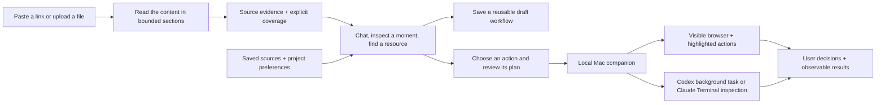

# ContextDrop

**Continuing this project in another AI? Start with [HANDOFF.md](HANDOFF.md).** The current development branch is `codex/contextdrop-next`; the active Mac checkout is `~/Developer/send-me-reel`.

Turn an internet example into something you actually try, build, or do.

ContextDrop turns videos, repositories, websites, images, PDFs, audio and text into a conversation you can act on. The local studio gives a short take, searches source details, compares saved content, remembers your project, and saves useful answers as reusable workflows. The Mac companion can guide a visible browser or hand a reviewed task to Claude Code or Codex.

**This branch adds a locally tested content companion and execution foundation.** The local studio uses configured provider keys and private files without a database. The production dashboard/bot additionally require a worker and database migrations. It does not promise access to every URL or unrestricted control of every Mac application.

**Personal Mac entry point:** run `npm run personal`, then open [ContextDrop on this Mac](http://127.0.0.1:3127/replicate/local). No Google or Supabase login is needed for this local flow. See the [September 15 real-link acceptance report](docs/LOCAL-ACCEPTANCE-2026-09-15.md) for measured results, fixes, and remaining release gates.



## What you can do

- Paste a link or upload a file. Choose one of three suggestions, or ask your own question.
- Find a mentioned tool, understand a technique, compare ideas, or prepare a small project when the source supports it.
- Review the task, then select **Yes, start**. Source content never authorizes execution by itself.
- The personal launcher connects the local companion. **Tasks** keeps the original source, live output and result together, even when you open another conversation.
- In browser mode, see the current page and highlighted target. Approve or decline each navigation, click, or fill; scrolling and inspection proceed automatically. Enter logins and private fields directly in the browser, then continue.
- Codex builds in a fresh project folder, with streamed output and built-in approval review. Claude Code opens an interactive inspection plan; its background execution and connected tools are not enabled.
- Download the plan as JSON or Markdown. Agent-reported completion is explicitly **unverified** until the output is checked.

Browser mode connects to the Chrome profile you explicitly select and operates its task tabs. It can navigate, click, fill ordinary fields, scroll, go back, and save downloads. It does not automate CAPTCHA, payment/private fields, arbitrary JavaScript from the model, or file uploads. Stop ends its task session without undoing actions or closing unrelated user tabs.

Native Mac app control is a separate supervised executor using the signed Peekaboo helper. It requires Screen Recording and Accessibility permission, and reviews each action. It supports Accessibility controls, not arbitrary pixel-only interfaces. Coding stays in the Codex/Claude flow. See [setup, tested boundaries and the remaining live-control check](companion/COMPUTER-CONTROL.md).

## Local setup

Use Node.js 24 to match the production build, npm, git, ffmpeg/ffprobe via the included packages, and a maintained `yt-dlp` executable with its matching EJS package for social media ingestion. The worker explicitly enables the existing Node.js runtime for YouTube challenges. For pip-based installations, use `python3 -m pip install -U "yt-dlp[default]"` in your chosen Python environment. The local companion requires macOS. Codex builds require an installed, signed-in CLI with the supported isolation and automatic-review flags; metadata is checked before launch. Browser guidance uses your `OPENAI_API_KEY`.

```sh
npm ci
npm --prefix web ci
npx playwright install chromium
cp .env.example .env
cp web/.env.example web/.env.local
```

Planning is capped at 20 provider attempts per user per day (shared with free chat). Each reserved attempt counts even if its provider call fails. `REPLICATION_MODEL` optionally selects the planning model.

Fill the environment files locally; never paste secrets into the frontend or a plan. The bot/worker and web app share Supabase settings and `JWT_SECRET`. Browser guidance reads `OPENAI_API_KEY` from the root environment. Apply the checked-in Supabase migrations, including `022_atomic_analysis_billing.sql`, before using the updated analysis submission and refunds. Existing production data must be reviewed before applying migrations; tests here do not apply changes to your live database.

For personal use, configure the provider keys locally and run `npm run personal`. It starts the web app and companion, keeps the Mac awake while running, and reuses a healthy session instead of starting duplicates. The processes bind to loopback. Keep its terminal open; use Ctrl+C to stop its owned processes.

For the separate hosted dashboard/bot development flow, start the required services individually:

```sh
# Worker + Telegram bot (requires configured .env)
npm run dev

# Web dashboard
npm --prefix web run dev

# Mac companion. Origin must exactly match the address in your browser.
npm run companion -- --origin http://localhost:3000
```

Paste the companion's token into the execution panel. The token lasts only for that companion session and is kept in browser memory, not local storage. Output folders are created under `~/Developer/contextdrop-runs/<run-id>/project`. Keep the companion Terminal open. A custom port and output root are available with `--port` and `--root`.

The development-only `/replicate/demo` page uses labelled fixture content for UI inspection without provider credentials. It does not analyze a live video and does not enable real execution.

### Local content studio

The optional `/replicate/local` development studio starts with a conversation, then offers relevant links or reviewed tasks. Its interface uses the installed `apple-design` skill: restrained surfaces, system typography, keyboard-accessible dialogs, and a compact mobile composer. It saves sources, conversations, drafts, your project profile and draft workflows on this Mac.

Automatic reading uses Gemini when configured: public YouTube videos up to sixty minutes use bounded native-video sections; downloaded Instagram/TikTok/X videos up to ten minutes and 100 MiB use audio/video understanding plus a bounded local screen-detail scan. The scan preserves selected full-resolution regions across the timeline and submits them as high-resolution images. It can miss details and always reports partial semantic coverage. Public websites and GitHub READMEs use text extraction. OpenAI's frame/transcript reader remains an explicit alternative; a failed Gemini request does not silently charge another provider.

Uploads provide a fallback when a link cannot be retrieved: video/audio up to sixty minutes and 200 MB, images/PDFs up to 20 MB (PDFs up to 100 pages), or UTF-8 text up to 1 MB. See [upload formats, privacy and actual coverage](docs/UPLOADED-CONTENT.md). Social image/carousel posts require uploads today. Source access varies by post; “any kind of content” is a reader architecture, not guaranteed access to every URL.

Use **My project** to tell the assistant your goal, preferences and coding app. Ask it to compare items in **Library**; it reads them without replacing the current source and cites them separately. Choose **Save workflow** under a useful answer to reuse it with another source or download a draft `SKILL.md`. Saving a workflow does not execute or verify it. See the [architecture, concrete examples, costs and current boundaries](docs/CONTENT-COMPANION.md).

Set `CONTEXTDROP_LOCAL_STUDIO=1` and `OPENAI_API_KEY` in `web/.env.local`, and configure `OPENAI_API_KEY` in the root `.env`. Add `GEMINI_API_KEY` to both local environment files for native YouTube understanding and short high-resolution reinspection. The other social-video capture path uses yt-dlp; the production worker additionally supports Apify fallback through `APIFY_TOKEN`. `CONTENT_CHAT_MODEL` selects the conversational model (default `gpt-5.4-mini`). Then run `npm run local:studio` and `npm run local:companion` in separate terminals. Visit `http://127.0.0.1:3127/replicate/local`. The private companion session enables an explicit **Connect this Mac** button; it does not authorize a task automatically. This studio rejects production mode, remote hostnames, and cross-origin mutations. Bind development servers to loopback.

The personal launcher selects streamed Codex builds. `CONTEXTDROP_CODEX_MODEL` optionally selects a supported model. Runs ignore project/user customizations, disable hooks, retain native CLI authentication, use a workspace sandbox with network access for dependencies, and use Codex automatic approval review when a tool needs more permission. This is not a full filesystem read-isolation boundary. Under **Change task or app**, GitHub and Vercel can be selected through existing native Codex connections; the runner must discover actual tools before claiming access. Selection expresses task intent, not a per-tool access sandbox. Publishing still needs approval of the concrete action. A zero exit means the result needs review.

Captures and run state are private, ignored files under `.contextdrop/`. The downloader uses explicit `YTDLP_PATH`, then `.contextdrop/media-runtime/bin/yt-dlp` when installed, then the system executable. See [video evidence and runtime setup](docs/VIDEO_EVIDENCE.md). Browser guidance sends its task tabs' screenshots and visible text to the configured OpenAI model; keep private fields for manual input.

The **Start rehearsal** button at `/replicate/demo` is a separate recorded-example walkthrough that makes no provider or companion requests. It is available as a clearly labelled offline fallback for presentations.

## Verification

```sh
npm test
npm run build
npm run check:companion
npm --prefix web run build
# With the development server running on 127.0.0.1:3127:
npm run test:ui
npm --prefix web run test:content
```

Tests include synthetic video extraction, structured evidence validation, retries and persistence failures, URL/proxy/account boundaries, local companion pairing, and a real Chromium approval/click flow using a deterministic test planner. Those offline tests do not establish the quality of a live model on arbitrary tutorials.

See [the implementation audit](docs/IMPLEMENTATION-AUDIT.md) for evidence, known limits and the next release gates, and [the product direction](docs/PRODUCT-DIRECTION.md) for the intended full experience.

## Repository

- `src/`: worker, bot, media retrieval, transcription, evidence analysis, persistence.
- `web/`: Next.js dashboard, authenticated planning API, review and execution UI.
- `shared/`: bounded, data-only replication plan contract.
- `companion/`: loopback pairing server, guided browser, checked-IP network proxy, Terminal runner.
- `supabase/migrations/`: database schema and transactional credit functions.
- `tests/`: offline regressions and controlled browser workflows.
