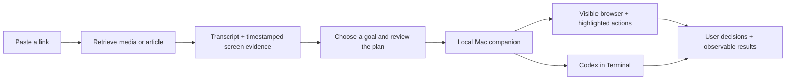

# ContextDrop

Turn an internet example into something you actually try, build, or do.

ContextDrop accepts social links through its web dashboard and Telegram bot, captures source content, and prepares a task grounded in the creator's words and sampled on-screen actions. The new local Mac companion can guide a visible browser workflow or open a Codex build session in Terminal.

**This branch adds a locally tested execution foundation.** Live provider credentials, a running worker, and the database migrations are required for real links. It does not promise access to every URL or unrestricted control of every Mac application.



## What you can do

- Open a finished analysis and choose **Build / automate this** to prepare a source-linked task.
- Adapt the goal: build, automate, create, or research. Observed steps and proposed additions are distinguished.
- Review prerequisites, missing evidence, source timestamps, and outcome checks.
- Pair the Mac companion using a session token. Choose a guided browser walkthrough or a Terminal build.
- In browser mode, see the current page and highlighted target. Approve or decline each navigation, click, or fill; scrolling and inspection proceed automatically. Enter logins and private fields directly in the browser, then continue.
- In Terminal mode, Codex works in a fresh project folder with normal approval and workspace restrictions.
- Download the plan as JSON or Markdown. Agent-reported completion is explicitly **unverified** until the output is checked.

Browser mode uses an isolated Chromium session. It can navigate, click, fill ordinary fields, scroll, go back, and save downloads. It does not automate CAPTCHA, payment/private fields, native Mac apps, arbitrary JavaScript from the model, or file uploads. A visible browser can remain open for manual review; Stop closes it without undoing actions already performed.

## Local setup

Requires Node.js 22+, npm, git, ffmpeg/ffprobe via the included packages, and a maintained `yt-dlp` executable with its matching EJS package for social media ingestion. The worker explicitly enables the existing Node.js runtime for YouTube challenges. For pip-based installations, use `python3 -m pip install -U "yt-dlp[default]"` in your chosen Python environment. The local companion requires macOS. Terminal mode uses an installed and signed-in Codex CLI; browser guidance uses your `OPENAI_API_KEY`.

```sh
npm ci
npm --prefix web ci
npx playwright install chromium
cp .env.example .env
cp web/.env.example web/.env.local
```

Planning is capped at 20 provider attempts per user per day (shared with free chat). Each reserved attempt counts even if its provider call fails. `REPLICATION_MODEL` optionally selects the planning model.

Fill the environment files locally; never paste secrets into the frontend or a plan. The bot/worker and web app share Supabase settings and `JWT_SECRET`. Browser guidance reads `OPENAI_API_KEY` from the root environment. Apply the checked-in Supabase migrations, including `022_atomic_analysis_billing.sql`, before using the updated analysis submission and refunds. Existing production data must be reviewed before applying migrations; tests here do not apply changes to your live database.

Start each in a separate Terminal:

```sh
# Worker + Telegram bot (requires configured .env)
npm run dev

# Web dashboard
npm --prefix web run dev

# Mac companion. Origin must exactly match the address in your browser.
npm run companion -- --origin http://localhost:3000
```

Paste the companion's token into the execution panel. The token lasts only for that companion session and is kept in browser memory, not local storage. Output folders are created under `~/Developer/contextdrop-runs/<run-id>/project`. Keep the companion Terminal open. A custom port and output root are available with `--port` and `--root`.

The development-only `/replicate/demo` page uses labelled fixture content for UI inspection without provider credentials. It does not analyze a live video and does not enable real execution.

## Verification

```sh
npm test
npm run build
npm run check:companion
npm --prefix web run build
# With the development server running on 127.0.0.1:3127:
npm run test:ui
```

Tests include synthetic video extraction, structured evidence validation, retries and persistence failures, URL/proxy/account boundaries, local companion pairing, and a real Chromium approval/click flow using a deterministic test planner. Those offline tests do not establish the quality of a live model on arbitrary tutorials.

See [the implementation audit](docs/IMPLEMENTATION-AUDIT.md) for evidence, known limits and the next release gates, and [the product direction](docs/PRODUCT-DIRECTION.md) for the intended full experience.

## Repository

- `src/`: worker, bot, media retrieval, transcription, evidence analysis, persistence.
- `web/`: Next.js dashboard, authenticated planning API, review and execution UI.
- `shared/`: bounded, data-only replication plan contract.
- `companion/`: loopback pairing server, guided browser, checked-IP network proxy, Terminal runner.
- `supabase/migrations/`: database schema and transactional credit functions.
- `tests/`: offline regressions and controlled browser workflows.
