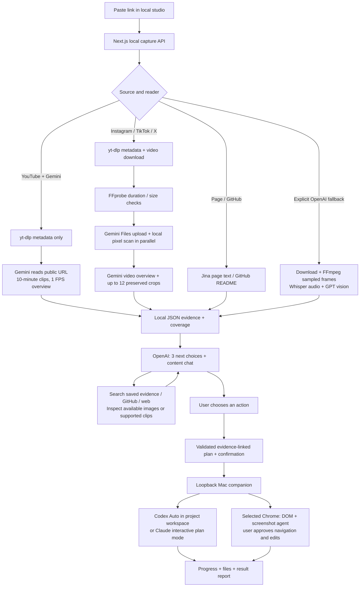
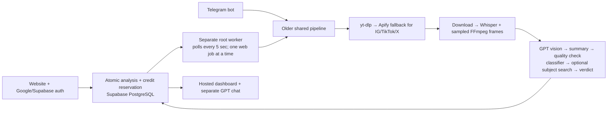
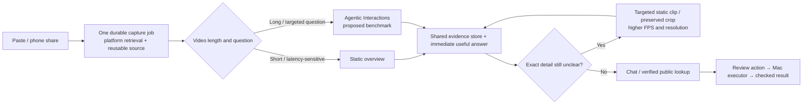

# ContextDrop architecture audit — 17 September 2026

Read-only code audit of `codex/contextdrop-next`, HEAD `732bd2e`. This report describes implementation, not a live deployment or connected-account acceptance test. No provider calls, runtime changes, commits or pushes were performed for this audit. Paths below are relative to the repository root; line numbers refer to that revision.

## Main finding

**There are two materially different products in this repository.** The personal Mac studio has Gemini capture, evidence tools and local execution. The hosted website/Telegram pipeline still uses the older OpenAI transcript/frame/verdict path. Pushing the branch alone does not make the personal studio available on Vercel. Its local APIs intentionally return 404 outside development/loopback (`web/src/lib/local-studio.ts:7–15`).

## Exact local flow

- **Entry and persistence:** `POST /api/local/capture` validates source, serializes one capture at a time, archives previous evidence, launches a detached fixed-argv worker and returns 202 after a 2-second initialization wait (`web/src/app/api/local/capture/route.ts:21–66`). Evidence lives under `.contextdrop/local-analysis.json`, `library/`, `captures/`; conversations use per-source JSON (`web/src/lib/local-library.ts:45–75`; `web/src/lib/local-conversation.ts:20–36`). There is no local SQL/vector database.
- **Routing:** `web/src/lib/capture-routing.ts:4–14` chooses native YouTube/Gemini when configured, otherwise downloaded social capture. Non-social URLs use the public page reader. Instagram image posts/carousels still enter the video path; this is not universal post support.
- **YouTube:** `scripts/capture-gemini.ts:116–148` gets public identity/duration with yt-dlp, then sends the URL to Gemini. Default source model is `gemini-3.5-flash-lite` (configurable), maximum 60 minutes, sequential 600-second clips, 1 FPS and low media resolution (`src/services/geminiVideo.ts:4–9,390–472`). No separate transcript or local screenshot set is produced. Speech is a model paraphrase.
- **Instagram/TikTok/X local:** `scripts/analyze-video.ts:122–158` directly invokes yt-dlp metadata/download, prefers 1080 resolution, enforces **10 minutes / 100 MiB**, then calls the hybrid reader. **It does not use the repository’s Apify fallback.** Public availability, rate limits and downloader compatibility still determine whether retrieval succeeds.
- **Hybrid precision:** Upload and local scan overlap, but Gemini analysis waits until both finish (`src/services/precisionVideoCapture.ts:35–79`). FFmpeg decodes source frames, and a regional pixel/edge-change heuristic selects source-resolution crops. This is **not OCR**. Limits: 45 seconds scan time, 18,000 decoded frames, 12 crops, 6 MiB total crop bytes (`src/services/precisionVideo.ts:14–18,104–139,198–271`). The model receives the video plus the crops. The scan can stop early or miss the relevant region; decoding a frame does not mean understanding it.
- **OpenAI fallback:** Explicitly selectable or used when Gemini is absent; not an automatic second paid retry after Gemini failure (`scripts/analyze-video.ts:120–121,202–204,216–278`). FFmpeg extracts at most 96 frames, width 1280; preferred interval is 1 second for ≤30 seconds, 2 for ≤60, otherwise 3, widened to fit the cap (`src/services/frameExtractor.ts:14–41`). Whisper-1 produces untimed speech text; GPT-5.4-mini reads image batches, max two requests concurrently (`src/services/transcriber.ts:31–40`; `src/services/visualAnalyzer.ts:10,85–104,125`).
- **Uploads:** Gemini can read uploaded video/audio up to 60 minutes, images, PDFs and text. Video/audio upload cap is 200 MiB (`src/services/uploadStore.ts:27`; `src/services/uploadedContent.ts:65–79,152–195`). Uploaded videos currently use native Gemini overview, **not the downloaded-video precision scan**. Thus “upload fallback” and “social video capture” do not have identical detail coverage.
- **Pages:** Jina Reader extracts page text; GitHub API reads metadata and README, with a 60,000-character stored-text cap. It does not inspect page appearance, linked pages or run repository code (`web/src/lib/public-page-reader.ts:6–7,73–110`).
- **Understanding/chat:** Default `gpt-5.4-mini`, configurable via `CONTENT_CHAT_MODEL`, generates the three choices and drives a bounded tool loop (`web/src/lib/local-content-guide.ts:6–18`; `web/src/lib/local-conversation.ts:39–48,125–146`). It receives summary/caption/observations plus coverage; its overview caps transcript at 30k characters and observations at 240, with lexical retrieval over all stored evidence (`web/src/lib/content-conversation.ts:71–87`; `web/src/lib/source-retrieval.ts:21–60`). Tools include GitHub search + parallel top-two README reads, public web search, public page reader, saved-source lookup and visual reinspection. These are stored/model observations, not direct omniscient access to the video.
- **Reinspection gap:** `inspect_moment` reads a ≤30-second public YouTube clip at 2 FPS/high resolution. `inspect_upload` handles saved uploads. Downloaded Instagram/TikTok/X sources can supply retained selected images, but currently have no equivalent arbitrary-original-clip reinspection tool (`web/src/lib/local-conversation.ts:40–45,256–286`; `src/services/geminiVideo.ts:360–384`).
- **Phone intake:** iCloud Shortcut links enter a local inbox without auto-running capture; optional Telegram pairing imports that owner’s **completed cloud analyses**, with no local source images (`scripts/phone-sync.ts:1–35`; `web/src/lib/local-share-inbox.ts:143–183`; `web/src/lib/local-phone-inbox.ts:185–210`). This is not phone remote-control of an arbitrary computer task.

## Exact hosted / Telegram flow

- Vercel runs the `web/` Next.js package, not native media capture. `/api/analyze` requires session auth and the atomic Supabase RPC `create_analysis_with_credit` (`web/src/app/api/analyze/route.ts:9–54`). Google uses Supabase OAuth with a bound PKCE/state flow; app session is a signed `cd_session` cookie (`web/src/app/api/auth/google/route.ts:17–36`; `web/src/lib/auth.ts:27–42`).
- Root worker only starts its queue after the Telegram bot starts (`src/index.ts:9–16`). Queue polling is every 5 seconds, concurrency one per process, maximum three attempts (`src/pipeline/queueWorker.ts:8–10,77–140`). Website availability does not prove this separate worker is alive.
- The shared hosted media pipeline uses yt-dlp then Apify actors for Instagram/TikTok/X, content identity checks, download/CDN fallback, ≤10-minute media, Whisper and the same max-96 sampled-frame reader. It then makes several serial AI calls (`src/pipeline/orchestrator.ts:225–451`; `src/services/apifyScraper.ts:15–45`). **It does not call Gemini.**
- Telegram has a 180-second top-level timeout (`src/pipeline/orchestrator.ts:124–159`). The web queue calls a different dispatcher with **no equivalent overall deadline**; per-service timeouts/retries apply (`src/pipeline/orchestrator.ts:584–627`). Do not treat three minutes as a universal runtime limit.
- Hosted chat differs from local chat: GPT-5.4 + web search, streaming output, Supabase threads, transcript truncated to its first 4k characters and visual summary to 1.5k; it has no local `search_source`, `inspect_moment` or GitHub resolver toolset (`web/src/app/api/analyses/[id]/chat/route.ts:116–214`). Long-content follow-up can lose later evidence.
- **Finding at `732bd2e`, before the current landing repair:** signed-out submit stores a link and displays “analysing”/“about 30 seconds” before starting any analysis (`web/src/components/landing/HeroSection.tsx:82–104,194–195`). Signed-in users route to dashboard. The active repair addresses this wording and the missing local landing-to-studio transition; this audit does not claim those pre-repair defects remain after that work is verified.

## Execution boundaries

The app is **not yet an Astra-like general desktop agent**. The companion is a separate localhost service with origin/token checks and persisted task workspaces (`companion/server.ts:168–201,273–349`).

- Codex launches `exec`, `workspace-write`, automatic approval review, with selected existing Codex connections; it does not blindly bypass permissions. A background run has a **20-minute limit** (`companion/runner.mjs:60–72,125`). Claude is interactive safe/plan mode, with MCP/Chrome disabled; background Claude is rejected (`companion/execution-policy.mjs:17–34`). Provider/DB credentials are not copied into the child environment.
- Browser actions use Playwright CDP against explicitly selected, signed-in Chrome; a random pairing tab proves the selected browser context (`companion/chrome-connector.ts:30–66`). Real Chrome connection must still be live-verified; setup selection is not proof of connection.
- Browser planner is GPT-5.4-mini by default, reading DOM controls and screenshots. It supports navigation, clicking, filling, scrolling, back and wait, maximum 30 actions. Navigation/click/fill/back require user approval; private fields/CAPTCHAs need the user. It cannot operate arbitrary macOS applications or arbitrary uploads (`companion/browser.ts:11,56–72,186–227`). Browser “finish” is deliberately recorded as `finished_unverified`, not independent proof of goal completion (`companion/browser.ts:203–210`).

## Highest-value changes, in order

1. **One capture/chat engine with two adapters.** Share a versioned source-evidence schema and worker code across local and hosted. Keep storage/auth/queue adapters separate. Otherwise every reader improvement helps only one UI and tests can hide divergent behavior.
2. **Reliable acquisition before more models.** Bring bounded Apify fallback into the local social adapter, with exact content-ID verification and explicit cost policy. Detect carousel/image/text posts and offer upload when media access fails. A signed-in browser is not a universal scraper or CAPTCHA cure.
3. **Progressive answer + targeted precision.** Produce the useful overview as soon as available; index detected scene/text changes, preserve enough source to revisit exact moments on all platforms, and run expensive crops/reinspection only for uncertainty. Current crop scan can add up to 45 seconds before the first Gemini answer; a 12-crop heuristic cannot fulfill “catch every millisecond”. Use timed speech if exact quotes/alignment matter.
4. **Durable jobs and measured speed.** One task table/event stream, idempotent capture IDs, stage timeouts, resume/cancel, content-hash+reader-version cache, limited parallel clips. Start the worker independently of Telegram. Record p50/p95 and failure rates per platform/video length, plus time to first useful answer. Current timeout constants are ceilings, not benchmark results.
5. **Finish the product promise narrowly.** Preserve the orange hero; paste → immediate task/dashboard → honest progress → three clear choices → one review → result. Keep read-only lookups in chat. Browser and terminal completion need observed outcome checks, not agent prose or process exit alone. Remove unsupported “30 seconds”, “any post”, and every-frame guarantees.

## Recommended architecture — proposed, not enabled

Evaluate Gemini **agentic video processing for long videos and targeted questions**. Google's current Interactions API supports `processing: "agentic"` on Gemini 3.5 Flash Lite, 3.6 Flash, 3.7 Flash and 3.8 Flash. Static processing defaults to 1 FPS; agentic mode explores relevant moments dynamically. Agentic navigation can **increase time to first token on short clips**; custom FPS and clipping controls are static-only. This is a benchmark candidate, not a guaranteed speed improvement or complete-frame understanding. [Google video understanding documentation, checked 17 September 2026](https://ai.google.dev/gemini-api/docs/video-understanding#agentic-video-understanding).

Current code calls `generateContent`, not Interactions (`src/services/geminiVideo.ts:320`). Benchmark both modes on the same sources and questions, measuring time to useful answer, final latency, cost and exact-name/text recall before choosing defaults.

## Speed and trust conclusion

Code cannot establish how many seconds a current Instagram/TikTok/YouTube/X analysis takes. Duration, media availability, download/upload, model processing and selected reader all matter. This audit made no live provider calls; a per-platform timing table requires an actual fresh source sample with timed stages. The prior ~4.7-second GitHub lookup is **follow-up search**, not full video analysis.

The local app is credible for **accessible links → source-grounded answers → a reviewed small task**. It does not yet justify a promise of all posts, every fleeting detail, instant video analysis or autonomous general computer control. Tests/builds are valuable regression evidence; they do not prove current social access, hosted worker health, correct model interpretation, or real signed-in Chrome execution.
