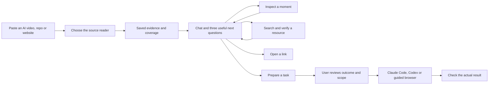

# ContextDrop: use the AI content you encounter

The product is a conversation around a source, with tools attached. A link is context, not an instruction to reproduce everything in it. The first useful result is a short explanation and three relevant questions. Building, researching, opening a website and understanding a skill are different outcomes.

## What is implemented locally

Open `http://127.0.0.1:3127/replicate/local`. The dark/orange interface starts with the content conversation. Task controls appear when a user selects a proposed action. Sources and their conversations are saved separately on this Mac; Saved content restores earlier captures.

- Public YouTube: Automatic selects Gemini when configured. Native audio/video analysis uses ten-minute clips up to a measured hour. Completed clips checkpoint to disk; retrying the same failed capture resumes completed work. The default is an economical overview at 1 FPS/low resolution.
- Instagram, TikTok and X video: existing yt-dlp capture, up to ten minutes, separate transcription and sampled saved frames. Availability depends on platform access. This local path does not yet use the production Apify fallback; X text-only posts are not a reliable local video input.
- Public websites: bounded Jina Reader text extraction. This captures readable page content, not a screenshot or every interaction.
- GitHub repository links: canonical public GitHub metadata and README text, with no repository code execution.
- Chat: OpenAI Responses with the smaller configured model, source evidence, recent conversation, web search, public GitHub search/verification and inspection tools. A typical short video retains all observations and transcript; long inputs expose explicit transcript/index bounds. The last twelve chat messages are sent, while up to 120 are saved.
- Visual questions: inspect up to three stored source images, or re-read a specific YouTube clip up to thirty seconds at 2 FPS/high resolution through Gemini. Exact reinspection questions reuse their saved completed results. A native overview is not a verbatim transcript, and a processed time range is not proof that every fleeting character was read.
- Resource identity: GitHub existence is distinct from source match. Exact owner/repo text in stored observations can match a canonical repository; approximate search results remain candidates. Unknown private/CTA resources are not invented.
- Actions: public links open when clicked. A coding/browser action first becomes a reviewed plan. The companion offers Codex and Claude Code; Claude opens an interactive inspection in plan mode with normal authentication and repository customizations disabled. The coding agent still needs to inspect and acquire a proposed repository; ContextDrop does not yet guarantee a pre-cloned repository workspace.

This is a local preview. It is not a cloud sandbox or a general Mac desktop agent. Guided browser interaction already exists through the companion, but arbitrary native app clicks, automatic account creation, and unattended execution are not implemented. Provider calls use API billing separately from the user's Claude Code or Codex subscription.

## A concrete example

For the supplied 8m37s design roundup, the useful conversation is: “Which inspiration websites does he show?”, “What is the Scroll Craft skill doing?”, or “Help me make a landing page with that kind of depth.” It should not invent a step-by-step build demonstrated by the creator.

For a fleeting GitHub screenshot: locate the likely moment, inspect the captured frame or short clip, collect literal owner/name clues, search public sources, verify the repository, and show the match with its evidence. If the original is unavailable, say so and offer a clearly labeled alternative. A user can then request an inspection in Claude Code; a task plan carries the source, uncertainty, goal and success criteria into the chosen harness.

## Cost and why this architecture

Keep the existing acquisition/companion code and use model APIs as replaceable adapters. Do not add several overlapping agent/browser frameworks. The user's own RecordFlow project has useful evidence/gap ideas; Agent-Reach is an acquisition reference, not a visual understanding engine. The original cheap-provider experiment contains useful evaluation cases but did not establish equivalent quality.

The real Gemini smoke on the supplied 517-second video completed in **21.233 seconds**, returning twelve validated observations. Recorded usage was 47,345 input and 1,438 output tokens; applying current published rates yields about **$0.0178 for that successful call**. Two debugging calls bring that small experiment to about $0.043. This is a rate-based estimate, not an invoice. Latency and accuracy vary by video.

Research models a ten-minute native pass at roughly 2–6 cents and a one-hour input split into six clips at roughly 13–35 cents, depending on detail, under the documented output assumptions. Chat, targeted reinspection, search, retries and code execution are additional. Current local controls cap chat at 100 turns/day, five model rounds/eight custom tool calls per turn, and 180 seconds per chat request; these are guardrails, not a dollar budget.

Sources and assumptions: [native-video research](research/video-understanding.md), [GitHub/OSS research](research/github-and-open-source.md), [reuse and harness research](research/reuse-and-harnesses.md), [Google pricing](https://ai.google.dev/gemini-api/docs/pricing), [OpenAI pricing](https://developers.openai.com/api/docs/pricing).

## What needs to happen before selling it

The next technical investment should be a shared capture/job library, rather than more controls on this local screen. Production needs owned source records and durable jobs, cancellation/retry leases, explicit per-user spending, provider fallback reporting, artifact cleanup, and a consistent evidence-to-action permission record. It also needs an evaluation set of real AI Reels/X posts/YouTube clips: multiple tools, a tiny repository header, speech/name disagreement, a private CTA, a long recording and an inaccessible source. Measure identity precision, missed visual details, useful recommendations, task success and cost.

Do not describe this as “handles any link” or “does anything on your Mac” before those cases are verified. The working local slice is useful now: content → grounded conversation → verified resource or reviewed task. Commercial reliability is a further engineering milestone.

A separate live 395–425s reinspection returned four timestamped observations identifying Godly and 21st.dev. Recorded usage: 16,887 input / 724 output tokens, about $0.0069 at the same published rates. This verifies a real nonzero-offset clip; it does not establish hour-long production reliability.
