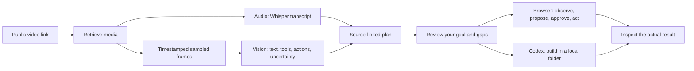

# ContextDrop presentation runbook — 2026-09-06

## The pitch

“People save thousands of things they want to try. ContextDrop turns that saved inspiration into action. Drop a tutorial, choose what you want, and it reads the spoken instructions and what happens on screen. It prepares a plan tied to that evidence, then helps carry it out through a visible browser or a local coding session. You see the proposed action and stay in control.”

## How the implementation actually works

The current system samples a video; it does not send the entire motion stream to a video-native model. Audio uses `whisper-1`. Screen observations use `gpt-5.4-mini`, in four-frame batches with two calls running concurrently. Frames are up to 1280 pixels wide. Clips are limited to 600 seconds and 96 frames. This source has 95 analyzed frames; the planner selects 40 observations across the source to fit its evidence budget. Spoken-word timestamps are not yet captured. Brief transitions, tiny code, and hidden setup can be missed, and the plan carries those gaps.

There are three distinct milestones. **Captured** means media evidence was retrieved and processed. **Prepared** means a bounded plan passed source-reference checks and needs review. **Verified** requires checking the produced artifact or changed page. An agent saying it finished does not establish the third milestone.

## Demonstration sequence

1. Open `http://127.0.0.1:3127/replicate/local` and show the real source: [Creator Magic's Codex block-breaker tutorial](https://www.youtube.com/watch?v=Gda-1msq7pg).
2. Show what was captured: 8m53s, 1,634 transcript words, and 95 analyzed source frames. Open the 107s frame to show the creator's actual prompt. This source was captured in advance; do not imply analysis is instantaneous.
3. Show the goal and prepared plan. Point out observed versus inferred steps. This recreation targets the local game-building section and excludes cloud deployment, accounts, and purchases.
4. Click **Play the recreated game**. The actual generated result passed 16 independent Chromium checks after one documented resize correction. Demonstrate Start, paddle movement, pause and restart. A fresh **Open in Terminal** action creates another workspace and another real run; do not click it merely to replay an already completed result.
5. Use **Browser walkthrough** for browser-based tasks. The real planner proposes typed actions from the current screenshot and visible page controls. Navigation, clicks, text entry, and back actions require approval; scrolling can proceed automatically. Private fields are handed over to the user.
6. If connectivity fails during the presentation, open `/replicate/demo` and click **Start rehearsal**. Its recorded fixture is labelled throughout, including completion. Describe it as the interaction rehearsal.

## Platform evidence

| Platform | Implemented | Live evidence from this session |
|---|---|---|
| YouTube | Video retrieval and analysis | Codex tutorial: actual media, audio transcript,95 analyzed frames and plan |
| Instagram | Video retrieval and analysis path | A real 64.22s reel downloaded and probed: 720×1280 video plus audio. AI analysis of that reel was not run. |
| X | Video retrieval plus bounded single-post fallback; text fallback when unavailable | Offline path tests; no live X video validated |
| TikTok | Video retrieval plus Apify fallback | No live sample validated |

Private posts, login walls, expired links and platform changes still affect retrieval. This is a Mac-first local prototype. Full native application control, automatic account creation, one-click distribution, and production database/deployment readiness are separate work.

## Start and recover

- `npm run local:studio` starts the loopback web app on 3127.
- `npm run local:companion` starts the paired Mac runner on 43187. Keep it running.
- `npm run local:result` serves the saved, checked game on 3130 if its existing server stops. This example is committed under `examples/source-derived-game/` with provenance and verification; playing it does not generate another game.
- Local `.env` files hold the configured provider settings. Never project or paste their contents.
- Capture and plans survive reloads under private `.contextdrop/` files. Pairing stays in browser memory and can be reconnected explicitly after reload.
- See `docs/VIDEO_EVIDENCE.md` for the real capture report and `docs/VERIFICATION.md` for verification boundaries.
