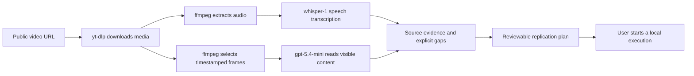

# How a video becomes usable evidence

The current implementation downloads media and combines a speech transcript with sampled screenshots. It does not send the entire moving video to a native video model, and it does not guarantee that every click or fast transition was observed.



Audio is transcribed with `whisper-1`. Its current output is plain text, without word or segment timing. Frames are resized to a maximum width of 1280 pixels and sent with high image detail to `gpt-5.4-mini`. Each call receives four source timestamps and images. Its structured output preserves visible text, software names, URLs, a description and uncertainty. Results with missing, fabricated, reordered or duplicated timestamps are rejected.

The preferred sampling interval is one second for clips up to 30 seconds, two seconds up to 60 seconds and three seconds thereafter. The frame budget is 96. Longer videos use a wider interval across the whole duration rather than silently dropping the end. At most two frame-analysis requests run simultaneously. The media duration must be at most 600 seconds, checked against the actual downloaded file.

The standard product pipeline additionally uses `gpt-5.4` for classification and its short verdict, with optional subject research. The local replication capture below skips those extra calls: the planner receives the actual transcript and individual frame observations directly. No Gemini provider is connected to this extraction path merely because a key exists.

## Reproduce the local capture

From the repository root:

```sh
python3 -m venv .contextdrop/media-runtime
.contextdrop/media-runtime/bin/python -m pip install 'yt-dlp==2026.8.19' 'certifi==2026.7.22'
```

`certifi` supplies the certificate trust roots needed by a clean macOS Python environment. TLS certificate verification stays enabled. The CLI and production worker share `src/services/mediaRuntime.ts`: explicit `YTDLP_PATH`, then this project-local downloader, then `yt-dlp` on `PATH`. Both select a complete video up to 1080p rather than downloading an unnecessarily large 4K source.

Supply `OPENAI_API_KEY` through the environment or the repository's private `.env`. The evidence services do not require Supabase or Telegram configuration and this command makes no database writes.

```sh
npx tsx scripts/analyze-one.ts 'https://www.youtube.com/watch?v=Gda-1msq7pg' \
  --output .contextdrop/local-analysis.json \
  --timeout-seconds 720 \
  --note 'Replicate the local block-breaker game. Exclude cloud deployment, accounts and purchases.'
```

This command performs actual paid transcription and visual-analysis requests only when the key is available. It does not execute the tutorial, create cloud accounts or deploy anything. Without the key it can download and extract frames, then records an incomplete capture rather than inventing a transcript.

The result is an `Analysis`-compatible JSON checkpoint. `status` progresses through `scraping`, `transcribing`, `analyzing` and either `done` or `failed`. It includes:

- `transcript`, `frame_descriptions`, actual source title/caption and source URL.
- `metadata.source_evidence`: measured duration, extraction/model status, counts, timing limitations and warnings.
- `metadata.local_capture`: current stage, process ID, timestamps and stage errors.
- `metadata.local_evidence`: absolute paths to the downloaded video and sampled JPEGs, their source timestamps, capture time and source URL.

The output is written atomically with private file permissions. Media and JPEGs remain in `.contextdrop/captures/<analysis-id>/` so the local studio can show real source frames. `.contextdrop/` is gitignored. Preserve a successful capture when demonstrating the planner; starting another capture makes new model calls and replaces the default checkpoint.

## Platform readiness

These are distinct evidence levels. Source routing tests do not establish that a live platform download works.

| Source | Implemented production acquisition | Live evidence in this sprint |
| --- | --- | --- |
| YouTube / Shorts | yt-dlp metadata and video download | Creator Magic's 533-second public Codex tutorial retrieved; real audio/frame analysis recorded in the local checkpoint |
| Instagram | yt-dlp, then a URL-specific Apify Instagram actor | Real reel `DXk3S2QjQNd` retrieved with matching ID: 10,232,788 bytes, 64.22 seconds, 720×1280 video plus audio. No AI analysis of that reel was run. |
| TikTok | yt-dlp, then a URL-specific Apify TikTok actor | Implemented; no new live TikTok capture in this sprint |
| X / Twitter | yt-dlp, then one status URL through Apify's single-tweet actor; public text fallback through Jina | Offline fallback/media/identity tests pass; no new live X capture in this sprint |
| LinkedIn | yt-dlp where available; public text fallback through Jina | Implemented; text fallback is not video observation; no new live LinkedIn capture in this sprint |
| Other webpage links | Jina article extraction in the production router | Text analysis; not a promise to download every embedded video |

The local CLI currently exercises yt-dlp directly. It does not launch Apify actor jobs. Authenticated/private, removed, blocked, geo-restricted and over-ten-minute sources need separate handling; none should be presented as fully watched merely because a caption was obtained.

The X fallback uses `apidojo/twitter-scraper-lite`, whose [publisher documents individual tweet URLs](https://apify.com/apidojo/twitter-scraper-lite). The previously configured [bulk actor forbids single-tweet fetching](https://apify.com/apidojo/tweet-scraper). The fallback accepts a status URL only, requests one item, caps actor charges at $0.10 and rejects results with a different tweet ID. Known text-only posts skip the actor. Provider failure allows explicitly labeled public-text analysis; it does not establish that the video was observed. These behaviors were tested with inert provider fixtures, not a live X job.

## Source selected for the pitch

The actual public source is [**OpenAI Codex: Watch AI Create & Deploy Code!** by **Creator Magic**](https://www.youtube.com/watch?v=Gda-1msq7pg).

The downloaded media measures 533.293 seconds and contains both audio and video. The successful acquisition produced 95 source JPEGs at approximately 5.61-second intervals. A sampled frame around 107 seconds visibly shows the creator asking Codex for a wizard-themed block-breaker game. The source's deployment section starts later; it is explicitly excluded from the local reproduction intent.

The real capture completed at **2026-09-06 15:12:56 UTC** with an **8,806-character Whisper transcript** and **95 successful frame observations out of 95 extracted frames**. Analysis ID: `eddca104-82eb-4e8e-b65c-07c485752f33`. The source media is 55,386,275 bytes. The checkpoint records the complete source URL, timestamps, actual model names and the warnings above. This verifies acquisition, transcription and sampled visual analysis. The generated replication plan and later build have their own verification states.
