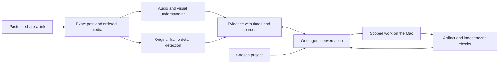

# ContextDrop: from a saved idea to a working result

**First research pass.** The [second research decision](deeper/README.md) supersedes the initial product emphasis and narrows the first build to an evidence tool inside existing agents. It adds a live competitor check, a demand ledger, pinned upstream inspection, a fuller cost model and a harder frame/OCR experiment. The audit below remains useful; its clean-frame result is not the latest robustness evidence.

**Recommendation:** build a premium Mac companion that turns AI content into a useful outcome in the user's own project. Own the difficult part—acquiring the real content, finding visual evidence, identifying the resource, and checking the result. Use an existing agent harness for reasoning and execution.

This report combines public market research, current provider documentation, an implementation audit and a small offline experiment. Research was checked on 12 September 2026. Competitor claims were read, not independently benchmarked; willingness to pay and broad social-platform reliability remain unproven. The implementation branch is `codex/contextdrop-next`, created from `ed2ec5e`. This report is a build decision, not a claim that the new application is finished.

## The product worth building

“I saved something interesting” is a weak starting point for a paid product. The stronger moment is: **“I want to use this, but finding the resource, judging it and getting it working is a chore.”** That moment gives ContextDrop a specific job and an observable result.

The first customer should be a solopreneur, designer who builds, or developer on Mac who already uses a coding agent and discovers AI tools through social content. They have projects, deadlines and an existing execution environment. Starting with everyone who saves anything would mix learning, entertainment, shopping and work into an untestable promise.

The product can eventually understand many kinds of content. Its initial commercial promise should be narrower: **turn the useful thing in an AI post into something you can try.** A short explanation, a correct resource, or a recommendation not to install something can be the right result. Do not push every source toward a build.

## Three priorities, in order

| Priority | The user's request | What ContextDrop must deliver |
| --- | --- | --- |
| 1. Find the thing | “What repo flashed on screen?” “What prompt is on slide four?” | Exact moment or slide, readable extraction, official resource verification, honest uncertainty. |
| 2. Make it useful for me | “Try this in my project.” “Make my version of this effect.” | Relevant setup or changes in a chosen workspace, progress in the same conversation, an openable result and recorded checks. |
| 3. Help me choose | “Is this actually useful for my app?” “Which of these three tools fits?” | A short recommendation using the source, current official information and the user's constraints; claims and demonstrations separated. |

The order reflects a dependency: if the resource is wrong, a competent coding agent can efficiently build the wrong thing. Resource identification and evidence should therefore be the first release gate, while a completed local task is the first end-to-end product demonstration.

Examples of the intended experience:

- A Reel silently shows a GitHub page. ContextDrop locates the relevant frame, reads the name, checks the public repository and offers to try its smallest example. If two owners remain plausible, it shows the two source-backed candidates before executing.
- A carousel explains a prompt workflow. ContextDrop preserves every slide in order, extracts the visible text, identifies missing steps and adapts the workflow to the user's business. It does not pretend an unseen prompt was extracted.
- A creator lists five AI websites. ContextDrop explains the differences and recommends one for the user's actual goal. “Open the right demo” can be enough; installing five tools is not a default action.
- A design video shows an interaction. ContextDrop explains the visible behavior, then creates an original implementation in the user's project and opens a preview. It distinguishes a similar effect from possession of the creator's source code.
- A long tutorial has useful information near the end. Chat retrieves the relevant section and screen evidence, then investigates prerequisites before adapting the workflow. The user does not have to supply the timestamp.

## What the market research changes

Saved-content chat is already a competitive category. Recall offers library chat and MCP/API access; Readwise's August release explicitly connects saved material to Codex and Claude through MCP, CLI and skills.[^1][^2] A bookmark library with chat and a terminal launch button is insufficient differentiation.

There is a more precise opportunity. Google's documented YouTube importer for NotebookLM/Gemini Notebook imports the transcript; it does not describe visual-video ingestion for that URL path.[^3] A briefly displayed, unspoken repository or prompt is a meaningful test case. This comparison is specific to that importer, not a claim that all competing multimodal models are incapable.

Creator comment-to-DM funnels are an established mechanism for distributing links and collecting leads.[^4] However, comments, views and annoyance are not evidence of paid demand for ContextDrop. Public discussions include both frustration with inaccessible saved information and people who do not want another organizing task. Some apparent demand threads are founders promoting their own products. The market memo includes these contradictions rather than converting them into a fictitious market size.

The proposed advantage has three parts: **better social visual evidence, less work between discovery and execution, and an outcome the user can verify.** Each part can be copied. The more durable asset would be a high-quality evaluation set, dependable source adapters and accumulated knowledge of which steps work in real user projects. This is a business hypothesis, not an established moat.

Do not build the business around defeating creators' lead funnels. Preserve attribution and link to legitimate resources. Extract what is visible; offer a clearly labeled reconstruction when asked; never claim access to a private download that the source does not reveal.

## The simple experience

The interface should have one dominant path:

**Drop → Ask → Do → See the result.**

Paste a link or share a post. A source card appears immediately with real progress. Once enough evidence exists, the agent gives a short useful observation and at most three relevant suggestions. The user can ignore the suggestions and ask anything about the source.

An answer about a visual detail includes a clickable moment or slide. Choosing an action keeps the same conversation: “I will open this verified repo in a fresh workspace and run its documented example.” Ordinary permitted steps proceed; an actual decision appears when needed. The agent returns the artifact or observed state, with checks and any remaining problem. The user should not move through an analysis dashboard, a plan wizard, a pairing page and a terminal just to understand whether anything happened.

The landing-page direction is restrained: a single phone containing a source, a small representation of the agent, and a real result. Proposed headline: **“Put your saved ideas to work.”** Supporting sentence: **“Drop a link. Ask about it. Make something with it.”** A real recorded source-to-result example is more persuasive than a glowing brain. Refero's Apple reference supplies useful restraint, scale and focus; it is inspiration, not a design to copy.[^5] The detailed [design brief](DESIGN.md) covers the interaction and claim boundaries.

## Architecture: one harness, useful tools

The application needs four substantial components, not an agent society: acquisition; media/evidence; one conversation/execution harness; and persistent source/run/result state. A local TypeScript service and SQLite can hold that state, with files for original media and evidence crops. Existing React work can support a packaged Mac UI after the first vertical slice works. Keep the public landing page separate from the privileged local runtime.

Use **Gemini for audiovisual reading**, with local detection/OCR for fleeting details. Use **GPT-6 Astra through an existing Codex harness** for hard reasoning and action. Astra's API supports image/text inputs; it is not a substitute for acquiring the video and reading its audio.[^6] Do not make a different product agent handle each UI stage.

The preferred new runtime to investigate is the **OpenAI Agents API with a self-hosted executor on the Mac**. It supplies managed session and orchestration capabilities, while the local environment provides files, commands and tools.[^7] It is new enough that the first integration must prove actual account access, cancellation, recovery and outcome return. Local Codex app-server is a useful private-beta fallback, but current documentation warns against treating it as production-supported.[^8] Select one path after this small test, not three parallel half-builds.

Computer use needs a real connected runtime. A model name or cloud API does not automatically give the application the desktop tools in the current Codex app.[^9] Prefer direct APIs and commands when they are reliable, browser control for website work, and native Mac control where genuinely needed. Approval should describe a meaningful work scope, with specific interruptions at sensitive boundaries. Full access does not make outcomes correct and does not replace verification.

Agent Reach is useful inspiration for acquisition fallback and capability checks. Its current Instagram code delegates to OpenCLI; the documented discovery commands do not establish complete arbitrary Reel/carousel media extraction.[^10] Evaluate that adapter and a paid fallback against the same source contract. Do not inherit a “supports Instagram” marketing claim merely because an upstream tool lists it.

The concrete paid fallback to test first is Apify's maintained Instagram Scraper: it documents post/Reel URLs, media URLs and carousel children.[^14] Our current mapping discards that richer shape. An actor response still needs exact-post checks, successful media downloads and validation of every child; a documented schema is not proof of reliable import.

## How to catch brief details without spending a fortune

“Every millisecond” cannot be an honest guarantee: a 30 FPS source contains an image roughly every 33 ms, and some prompts are cropped, blurred or never shown. Even decoding every frame does not mean a model understood every frame.

Use two cooperating reading passes. The audiovisual reader understands the topic and sequence. A local detector accounts for every available source frame, finding changed text regions and brief visual candidates. It retains exact frames and timestamps for high-resolution OCR or a focused model read. The agent can request more evidence while answering, and check extracted resources against current official pages.

An offline experiment in this branch demonstrates the basic failure mode. The generated four-second video contains a repository for one frame, a prompt for two frames and a command for half a second. Actual FFmpeg 1 FPS and 2 FPS sampling retained only the longest clue. A simple all-frame change detector selected seven of 120 frames and retained all three. Apple Vision then read the three intended strings correctly. This was clean synthetic footage: it proves a testable mechanism, **not real-world accuracy**, robustness to motion/compression or complete video comprehension. See [the reproducible experiment](EXPERIMENT.md).

Google's current video offering includes agentic navigation; benchmark it before writing our own elaborate video-agent loop.[^11] The full [video research](research-video.md) compares Gemini, TwelveLabs, local OCR and open-source reuse. Default overview and targeted inspection should share cached evidence; every chat message should not reread the entire source.

## Economics and a plausible business

The reader can be inexpensive. A planning estimate for a 30-minute static low-resolution overview, using the stated token assumptions, is about $0.06 with Gemini Flash-Lite or $0.14 with promotional Gemini 3.8 Flash pricing.[^12] Acquisition, retries, local processing, subsequent questions and execution are additional costs. These are not quotes for a complete workflow.

Execution can dominate. At Astra's current Standard short-context rates, a hypothetical run totaling 50,000 uncached input and 10,000 output tokens costs $1.00 in model usage alone.[^13] Long sessions, repeated context and reasoning can change this substantially. Meter completed tasks and failed attempts, impose understandable budgets, and allow the user to extend a run.

Test a $19–29/month product with bring-your-own usage or a small explicit allowance, rather than unlimited execution. That is a pricing experiment, not proven willingness to pay. A customer should pay for less setup and a reliable useful result; charging a premium for model access alone is fragile.

Start with ten qualified users and their recent real saves. Watch their existing workflow, then compare the same task in ContextDrop. Measure time and effort to the first useful result, whether they return for another task, and whether they commit to a paid pilot. The main metric should be **useful verified outcomes per retained user**, not links stored, plans generated or tokens consumed. Do not contact or recruit people automatically from this report.

## What to reuse and what to replace

The [code audit](repo-audit.md) found valuable structured evidence parsing, source identity checks, bounded uploads, resource resolution, credential handling and isolated workspaces. Preserve these small working components.

The problems are the seams: Instagram images and carousels do not have a proper media contract; the local social path bypasses a production fallback; local and hosted chat differ; global files represent the active source and plan; companion run discovery is in memory; and successful process exit stops at `finished_unverified`. The result UI even contains a demo-specific URL assumption. These are implementation findings from the current code, not inferred from README wording.

Replace those seams with durable `Source`, `Asset`, `Evidence`, `Session`, `Job`, `Action`, `Artifact` and `Check` records. A source being selected in the UI must not determine which job exists. A restart should not lose the action. A verifier should inspect the result relevant to the user's request; an agent saying “done” is not sufficient.

## Decision and release gate

Build the first complete example around **a real Instagram post → find the actual resource → ask a grounded question → run its smallest useful example → return the verified result**. Include photos and carousels, not only one lucky Reel. The [build plan](BUILD-PLAN.md) defines the sequence and the release scorecard.

If people use the discovery/extraction step but rarely execute, a premium evidence bridge for existing agents may be the better product. If they consistently pay to adapt content into working projects, expand those successful workflows. If they only want generic summaries, this is a crowded market with weak differentiation. Those outcomes should change the plan; a beautiful interface is not evidence against them.

The work completed in this branch is the audit, cited research, product/design decisions, implementation plan and offline transient-evidence experiment. No claim is made that the rebooted app, managed runtime or universal Instagram path is now built or ready to sell.

## Sources and supporting reports

The appendices contain additional current primary references, dates, assumptions and contradictions: [market](research-market.md), [video](research-video.md), [execution](research-execution.md), [code audit](repo-audit.md). All web sources below were accessed on 12 September 2026 unless a publication date is shown.

[^1]: Recall, [Pricing and features](https://www.recall.it/pricing), undated.
[^2]: Readwise, [Reader Public Beta Update #14](https://readwise.io/reader/update-aug2026), 6 August 2026.
[^3]: Google, [Supported source types](https://support.google.com/gemininotebook/answer/16215270?hl=en), undated.
[^4]: Manychat, [Automate Your DMs, Increase Instagram Sales](https://manychat.com/blog/automate-your-dms-increase-instagram-sales/), updated 1 April 2026.
[^5]: Refero, [Apple style reference](https://styles.refero.design/style/da7e5084-9e5d-4eb2-bb10-4c2d7733a56e), undated.
[^6]: OpenAI, [GPT-6 Astra model](https://developers.openai.com/api/docs/models/gpt-6-astra).
[^7]: OpenAI, [Agents API self-hosted environments](https://developers.openai.com/api/docs/guides/agents-api/environments/self-hosted).
[^8]: OpenAI, [Codex App Server](https://learn.chatgpt.com/docs/app-server).
[^9]: OpenAI, [Computer use](https://developers.openai.com/api/docs/guides/tools-computer-use).
[^10]: Agent Reach, [Instagram channel at inspected commit](https://github.com/Panniantong/Agent-Reach/blob/da5044d26fc6adddb6554d5679c94ac22e76e428/agent_reach/channels/instagram.py).
[^11]: Google, [Agentic video announcement](https://blog.google/innovation-and-ai/models-and-research/gemini-models/introducing-agentic-video-in-gemini/), 1 September 2026.
[^12]: Google, [Gemini API pricing](https://ai.google.dev/gemini-api/docs/pricing); arithmetic and token assumptions in the video appendix.
[^13]: OpenAI, [API pricing](https://developers.openai.com/api/docs/pricing).
[^14]: Apify, [Instagram Scraper documentation](https://apify.com/apify/instagram-scraper).
