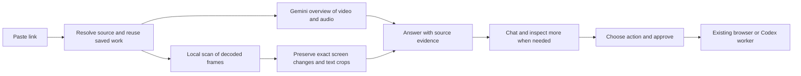

# Video analysis: recommended hybrid architecture

Date: 2026-09-15. Status: **researched and experimentally tested; not integrated into the app**.

## Decision

Keep ContextDrop's capture jobs, evidence storage, chat and reviewed Mac execution. Adopt selected `claude-video` techniques inside the local media worker. Use Gemini for video/audio understanding and reading selected screen details. A new Claude subscription, Groq key or hosted scraping service is not required for this design.

The important change is to preserve brief source details before asking an AI to interpret them. Increasing model intelligence cannot recover a frame that the pipeline has discarded. Conversely, decoding every frame does not establish that every frame was correctly understood.

This is the best-supported direction from the current audit, not a proven optimum across all videos. Short clips, long conversations and fast screen recordings need different processing policies.

## What was actually checked

- Audited `bradautomates/claude-video` at commit [`83da59fa78c3eee9e20f515fe75c438bb5166efd`](https://github.com/bradautomates/claude-video/tree/83da59fa78c3eee9e20f515fe75c438bb5166efd), including frame selection, downloads, captions and orchestration. Its MIT license permits adaptation with attribution when copying code. It is a preparation tool for a host model, not a new video-understanding model.
- Ran its frame, deduplication and timestamp suites against the Mac's existing bundled media tools: **32 tests passed in 5.40 seconds**. No global plugin or dependency installation occurred.
- Compared our current one-second sampler mechanism, upstream balanced selection, and local change preservation on two-second synthetic videos. The target appeared for one frame at 30 FPS. A separate negative control contained no target.
- Authenticated to Gemini using the configured project key. The model listing includes Gemini 3.5 Flash-Lite and 3.6/3.7/3.8 Flash. Actual inference succeeded with **Gemini 3.5 Flash-Lite**.
- Made five valid, bounded Gemini comparison requests on synthetic content. One additional request accidentally omitted the crop while constructing the experiment; it is explicitly excluded and retained in the accounting record. The corrected probe asserts that both video and crop are present.

### Measured result on the brief-repo fixture

The visible string was `github.com/example/rapid-q7x`, shown only at source frame 17, approximately 0.566667 seconds. The expected string was not provided in the question.

| Input to Gemini 3.5 Flash-Lite | Exact repo recovered | Request time | Input tokens |
| --- | --- | --- | --- |
| Whole video, static 1 FPS, low resolution | No | 1.737 s | 202 |
| Whole video, agentic processing | No | 2.253 s | 70 input + 382 tool-use |
| Three preserved full frames, high resolution | Yes | 1.466 s | 3,388 |
| Whole video plus automatically detected crop, low resolution | Yes | 1.233 s | 462 |

The hybrid request used **86.4% fewer input tokens than the three-full-frame request**, while recovering the same string in this test. This does not mean 86.4% cheaper than ordinary video analysis: it used more tokens than the static baseline, which missed the evidence. Estimated standard list-price model cost for the hybrid request was $0.00027360, excluding local compute and acquisition. This tiny fixture is not a representative per-video cost estimate.

Agentic mode was confirmed by actual `processing_call` and `processing_result` steps. It still missed the fleeting target. The negative-control frame request returned an empty URL list.

These are individual request observations, not p50/p95 measurements or general accuracy estimates. Downloading, local decoding and crop preparation are excluded from the request timings. The test deliberately places readable text between samples; it does not test speech, motion-heavy footage, real platform retrieval or long-video latency.

Raw results and limitations: [claude-video-gemini-results.json](claude-video-gemini-results.json).

## What to adopt from claude-video

1. **Caption-first extraction with timestamps.** Preserve manual/automatic caption provenance, then use audio transcription only where needed. This can avoid an unnecessary paid transcription pass. Adapt the language policy: upstream hardcodes `en.*`, whereas ContextDrop needs source-language captions too. Gemini's spoken summary must remain distinct from a verbatim transcript.
2. **Scene candidates and transcript cue points.** Add cut frames and moments around phrases such as “look here” to temporal coverage. Preserve discovered candidates when a scene detector finds few cuts; do not replace them wholesale with uniform sampling.
3. **Question-directed inspection.** Support high-detail rereads of the downloaded original for Instagram/X/TikTok as well as YouTube. “What repo was that?” should request exact source images or a short region of video, not only search the existing summaries.
4. **Explicit budgets and coverage warnings.** Cap paid model work per stage, checkpoint progress and leave unfinished regions marked as unchecked. A cap must not silently turn partial inspection into “complete.”

Upstream sources: [frame implementation](https://github.com/bradautomates/claude-video/blob/83da59fa78c3eee9e20f515fe75c438bb5166efd/skills/watch/scripts/frames.py), [download implementation](https://github.com/bradautomates/claude-video/blob/83da59fa78c3eee9e20f515fe75c438bb5166efd/skills/watch/scripts/download.py), [caption parser](https://github.com/bradautomates/claude-video/blob/83da59fa78c3eee9e20f515fe75c438bb5166efd/skills/watch/scripts/transcribe.py).

## What to change instead of adopting directly

- Its default visual dedup compares 16×16 grayscale thumbnails. In our image-pair probe, a legible repo-name change produced a mean delta of 0.8984, below the 2.0 threshold, and was deleted. Use text-region-aware comparison and retain originals. Low global visual change is not evidence that code or a prompt stayed unchanged.
- Balanced mode falls back when fewer than eight scene candidates exist. Both brief-target fixtures were missed. Its uncapped scene mode still does not mean that every original frame reaches the model.
- Timestamp extraction rounds requested seconds to two decimals. Resampling our detected 0.566667-second frame at 0.57 seconds skipped the target. Preserve the actual decoded frame with its source presentation timestamp and time base; do not round and seek again to reconstruct evidence.
- Its default 512-pixel-wide images can lose small code/URL text. Retain the available original resolution, send compact crops first, and escalate resolution when legibility requires it.
- Focused analysis still downloads the full video in the inspected downloader. Do not assume it saves source-download latency.
- Its command-oriented output, unbounded subprocess waits and permissive local path/URL handling should not replace ContextDrop's validated local worker boundary. Keep the existing URL checks, file isolation, timeouts, cancellation and source-as-untrusted-data rules.

## Processing policy to implement

| Situation | Initial work | Extra inspection |
| --- | --- | --- |
| Short Reel, TikTok or X video | Download once; decode for local changes; Gemini sees video/audio plus a bounded set of detected crops | Reinspect unreadable text and unexplained transitions from the original |
| Short public YouTube clip | Native URL overview can start immediately; obtain original media for the precision pass | Preserve and inspect brief details in parallel; report when original retrieval fails |
| Long talk or walkthrough | Benchmark Gemini agentic processing; use chapters and timestamped captions to index the content | Decode and inspect requested sections first; continue whole-source checking separately when requested |
| Exact prompt, command or repo request | Prioritize source pixels and exact speech around candidate moments | Escalate the relevant crop/clip to a stronger Gemini model only if the cheap pass is insufficient |
| Previously captured source | Reuse source hash, evidence and completed inspections | Only process newly requested time ranges or questions |

For short clips, the default can combine video and locally selected crops in one Gemini request. When acquisition or detailed scanning takes longer, stream an initial overview and keep a separate “checking details” status. Do not present the overview as a completed exhaustive inspection.

For long videos, Google documents adaptive video navigation through the Interactions API. It is a candidate for lower token use on targeted questions, not a guarantee of detecting every fleeting visual. We verified the mode on the short fixture, but have **not** benchmarked its long-video advantage. Preserve video-processing steps for follow-up interactions; a conversation ID is not itself a token-cost exemption. Use explicit storage/retention decisions, cancellation and durable checkpoints.

The local scanner must stream frames instead of loading long videos into RAM. Track presentation timestamps and decode failures. Use region-level motion/text tracking so a moving face does not force every entire frame through a paid model. OCR is an aid to locating and searching text; ambiguous characters must be checked against source pixels before identifying a repo. Keep candidate discovery, text recognition and verified resource identity as separate states.

Earlier [14-case stress results](FRAME-STRESS.md) already show why this needs care: a pixel-difference threshold missed readable low-contrast text, and moving backgrounds retained every frame in several cases. Our new successful fixture does not resolve those failures. Cheap screening must have an uncertainty fallback and must not advertise exhaustive semantic coverage.

## Integration order and release evidence

1. Add a versioned evidence manifest for exact frames/crops, source hash, presentation timestamps, inspected ranges, provenance and measured provider usage. Preserve compatibility with the current conversation and execution contracts.
2. Build the local precision worker and merge its evidence into Gemini short-video capture. Reuse the existing Gemini file-upload support for accessible social videos. Keep the current reader as an explicit fallback until comparisons pass.
3. Add timed native captions and original-media follow-up inspection. Avoid routinely paying both Whisper and Gemini to interpret the same audio; request a real transcript when the question needs exact words.
4. Add and evaluate the Gemini Interactions adapter for long videos. Start with the inexpensive configured model; assess a stronger model only on unresolved cases. Retain and charge-account all processing steps correctly.
5. Compare complete journeys using the user's three real links, then a held-out set spanning platforms, languages, durations, screenshots, motion, one-frame flashes, absent clues, unreadable text and inaccessible sources. Include natural questions, exact resource identification and supported Mac actions.

Release metrics: exact resource precision, missed visible targets, uncertainty calibration, speech timing, decoded/inspected coverage, first-useful-answer latency, total processing time, input/output/tool tokens, estimated dollars, failures and cache reuse. Report distributions and the worst cases. Existing UI/build tests alone do not prove this improvement.

### Current implementation boundary

This audit adds research and measurements only. ContextDrop's live routing still uses Gemini static video for public YouTube and the current sampled-frame/OpenAI path for downloaded social videos. No production deployment, global skill installation or runtime replacement occurred. The detailed worker, cross-platform Gemini routing and long-video Interactions integration above remain proposed.

### Primary provider sources, checked 2026-09-15

- [Gemini video understanding](https://ai.google.dev/gemini-api/docs/video-understanding): static sampling, adaptive processing, video/image inputs, detail controls and processing traces.
- [Interactions overview](https://ai.google.dev/gemini-api/docs/interactions-overview): state, storage, retention and follow-up conversation behavior.
- [Interactions API reference](https://ai.google.dev/api/interactions-api): request/response configuration and usage fields.
- [Gemini pricing](https://ai.google.dev/gemini-api/docs/pricing#gemini-3.5-flash-lite): standard Flash-Lite input $0.30 and output $2.50 per million tokens at the time checked. Estimates are not billing receipts.
