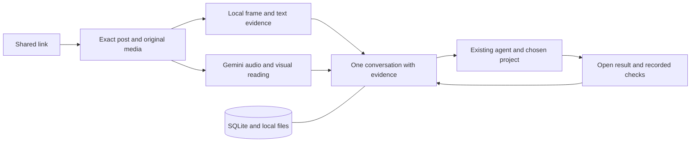

# ContextDrop: the second research decision

**Recommendation: build an evidence tool for existing agents first, then put a polished Mac conversation around the parts that prove useful. The paid job is helping an active builder turn an AI reference into a working result in their own project.**

This second pass changes the emphasis and reduces the initial build. It combines 22 first-person public reports, nine close substitutes, a live competitor Reel analysis, pinned code inspection, current provider pricing and a harder local frame/OCR experiment. Research date: **12 September 2026**. These are not customer interviews, proven demand or a finished app. The [self-imposed research brief](RESEARCH-BRIEF.md) records the questions and disconfirmation rules used.

## What changed

| Earlier hypothesis | New evidence | Decision |
| --- | --- | --- |
| Visual social chat is a useful opening. | Reelnest returned transcript, screen text and resource names for an actual AI Reel in its public demo. Readwise/Recall already connect saved content to agents. | Basic social chat is expected functionality. Demonstrate exact evidence, correct resource identity and a useful project result. |
| A custom Mac app is the obvious first product. | Free video-to-skill/code projects already provide agent-native workflows; an existing agent fixes setup problems for some users. | Start with a small reusable content/evidence service and one harness integration. The Mac UI is a thin client, gated by comparative success. |
| Saving without doing is the central pain. | Direct builder reports describe version mismatches, missing prerequisites and difficulty adapting tutorials to real needs. Many archive complaints are adjacent, not buyers of execution. | Target people trying something now. Offer finding, understanding, evaluating and doing; avoid a compulsory backlog of tasks. |
| A simple all-frame detector can cheaply preserve important details. | It kept 11/12 test targets but OCR recovered only 7. A readable low-contrast target was discarded; motion kept every frame. | Replace the pruning strategy before making accuracy claims. Measure extraction and understanding separately. |
| Agent Reach's Instagram path is mostly discovery. | Its newer upstream OpenCLI has an exact-media download reader for images, videos and ordered carousels. | Test that narrow pinned reader alongside Apify. Do not install/expose a broad publishing toolkit. |
| The cheapest reader should be the default. | Base modeled Flash-over-Lite cost is only about $3.52 extra/month; Astra execution is the dominant cost. | Choose reading quality by measured results; meter expensive actions. Do not weaken the core experience for a small saving. |

## The need we can defend

The strongest job is: **“I saw something I want to use. Help me find the right thing, decide whether it fits, and get it working here.”**

A CrewAI learner describes failing to reproduce video projects because dependencies and integrations do not match. An automation practitioner can follow examples but struggles to translate them into a client's real problem. Another developer reports paying for a stronger Claude plan to finish a game; Claude itself resolved the setup problem. That last example is both spending evidence and a competitive threat. [CrewAI report](https://community.crewai.com/t/where-to-start-in-this-ai-automation-journey/3387), [adaptation report](https://www.reddit.com/r/AiAutomations/comments/1tzg5cj/im_confused_and_i_dont_know_how_to_help_people/), [existing-agent retrospective](https://www.reddit.com/r/ClaudeAI/comments/1s7mfil/i_built_a_steam_game_in_10_days_with_claude_code/)

The demand ledger contains **22 reports across 21 discussion clusters; only six directly concern AI/automation/coding-agent builders**. It separately records seven excluded or weak leads. Search results are crowded with founders selling almost exactly our proposed idea. These do not count as independent customers. No evidence here establishes a large paying market for one-frame extraction, a preference for Mac, or willingness to pay ContextDrop specifically. [Demand analysis](demand.md), [auditable ledger](demand-ledger.json)

Mac remains a sensible engineering scope because it matches the user's environment. The first recruited customer should already have an active project and an existing coding agent. AI-media/GPU workflows can inform research, but cannot quietly expand a Mac product into universal local model setup.

## The product in one concrete interaction

> You share a Reel. “Can I use this in my app?”
>
> ContextDrop: “The repo shown at this moment is **X**. Here is the frame and its official page. The video uses an older setup. Your project can use the current version with these two changes.”
>
> **Try it in my project** → the existing agent works in a chosen workspace, opens the result, and shows what passed.

The result could instead be a recovered prompt, the correct website, an explanation, a smaller example, or a recommendation to skip a tool. The conversation follows the person's intent. “Make exactly the creator's keystrokes happen” is often the wrong implementation because versions, accounts, hardware and goals differ.

Keep three initial action classes: find/open a supported resource; run a repo's documented local example; adapt a visible UI behavior. Build the user interruption and browser observation needed for those tasks. Broader native computer control comes after specific app/action tests, not from granting a model blanket access.

## The smallest stack

- **Google:** video/image understanding, ordinary content chat and occasional search. Compare Flash with Lite on our real evaluation set; the stronger-looking name is not proof of superior performance.
- **OpenAI:** Astra for difficult adaptation and execution through one tested harness. A private evidence skill can work with the user's existing agent. Managed commercial integration must prove its runtime and billing independently; the desktop tool access available in this development session is not automatically an app API.
- **Local tools:** FFmpeg, Apple Vision, bounded web readers, yt-dlp where verified, and a narrow Instagram reader. Optional local speech transcription only if it earns its installation/maintenance cost.
- **Persistence:** SQLite/FTS5 plus local assets. Add semantic indexing only when exact/full-text retrieval fails real questions. No hosted vector database, compulsory browser SaaS or twenty MCP subscriptions.
- **Optional acquisition fallback:** Apify, billed by actual use. Exact post identity, every carousel item and downloaded media must be checked whichever adapter supplies them.

OpenCLI's inspected `download` code is promising but not live-verified here. Its `post`/`reel` commands publish; the app should expose only the bounded read capability. Agent Reach improves routing and capability discovery, not reasoning or source quality. Installing it would not make promotional Reddit content reliable. [Pinned reader and stack decisions](stack.md)

The managed Agents executor remains a time-boxed integration gate, not the centerpiece of a rewrite. If its current alpha setup cannot pass reconnect, interruption and result-return checks, private validation should continue through one pinned local bridge. Do not build three execution frameworks in parallel.

## The frame requirement, honestly

We should account for every available decoded frame on the detailed-inspection path. That is different from promising that every pixel is readable or every fact understood. The harder local experiment processed **840 frames across 14 synthetic clips**. Selection retained **11/12 transient targets**; normalized exact OCR recovered **7/12**. Giving OCR the correct time and crop recovered only **8/12**. One failure was our detector discarding text OCR could read. Motion removed its efficiency advantage. [Full results and reproducible experiment](FRAME-STRESS.md)

Keep originals, exact presentation times and region evidence; allow exhaustive rereading of an interval. Use audiovisual reasoning for meaning and local evidence for details. Do not put a fixed frame cap before a “complete” badge. Report missing media, pending inspection and unreadable text as distinct states. An unseen prompt can be reconstructed when requested, but must never be labeled extracted.

A valuable quality promise to work toward is **“You can inspect the evidence behind the answer.”** “Never misses anything” is not supported by this experiment or current provider documentation. Real social-media and long-video accuracy still require the locked release evaluation.

## Cost and pricing

The [cost model](cost-model.json) exposes rates, assumptions, retries, failures, support and storage. A hypothetical monthly user with 150 links, 450 video minutes, 300 chat turns and 12 Astra actions costs about **$20.07 in variable vendors**, or **$23.57 including assumed support/relay**, using Lite. All-Astra chat raises the latter to **$63.45**; switching reading/chat to Flash raises it to **$27.09** at current promotional rates. These are planning scenarios, not measured bills. Longer reasoning and action loops can be substantially more expensive. [Primary prices and sensitivities](stack.md#costs-must-include-failures-and-outcomes)

**Do not sell unlimited execution for $29.** Test a modest product fee with BYOK for technical early users; later offer a clear included reading allowance and separately bounded execution. The user's existing subscriptions are not assumed to subsidize an embedded commercial API. Vendor count should stay small, but one inexpensive fallback that rescues imports may be worth more than weeks maintaining a fragile scraper.

## How to market it

Proposed headline: **“Saw it. Make it work.”** Supporting line: **“Drop an AI post. Find what matters. Try it in your project.”**

Lead with a real, attributed example: fleeting repo → source frame → verified official repo → compatibility fix → working preview. Show elapsed time and costs. A clean phone-to-result visual can explain this; simulated success cannot prove it. Publish phone-sharing and action claims only after those surfaces work.

Start in existing coding-agent and automation communities with useful demonstration content, and test creator partnerships around “Try this example.” Creators may benefit from fewer repetitive setup questions and more successful adoption. No outreach or publishing has been performed. Avoid marketing around taking creators' secrets; the better value is making public information usable. [Marketing experiments and measurement plan](MARKETING.md)

## The next decision is empirical

Run the same real reference tasks through (1) Reelnest for understanding, (2) Gemini plus the person's existing coding agent, and (3) ContextDrop's narrow evidence bridge. Do not pretend the tools have identical scopes: compare shared understanding tasks, then compare action workflows separately. Use ten qualified Mac users and their own recent references, counterbalance task/tool order, retain failures and include cold imports. Measure correct resource, supported answer, user intervention, checked result, total effort, cost and voluntary second use.

The [canonical plan](../BUILD-PLAN.md) now puts this comparison before a large UI/runtime investment. Its two-week commercial hypothesis remains six of ten returning for a second useful task and three accepting a paid pilot after use. These are decision thresholds, not proof of product-market fit. If direct agents perform just as well, ship the useful evidence tool inside them. If users only value retrieval, narrow the product. If adaptation repeatedly saves effort and users pay, expand the polished Mac experience.

**Completed:** research, source ledger, live competitor observation, pinned code inspection, cost model, stronger local experiment and revised plan. **Not completed:** real-customer validation, integrated Instagram reader, production-grade execution runtime or rebuilt application. More same-bias searching will not settle those remaining questions; observed tasks and real integrations will.

## Evidence inventory

- [Demand](demand.md): 22 reports, 21 clusters, six direct builder reports, seven excluded leads; sources and uncertainty in JSON.
- [Competition](competition.md): nine candidates, two unestablished watchlist entries, one submitted-Reel demo observation and code-level sampling limits.
- [Stack](stack.md): pinned upstream code, official provider/runtime/storage documentation, licensing and maintenance constraints.
- [Cost model](cost-model.json): assumptions and low/base/heavy sensitivities, including failed work.
- [Frame stress test](FRAME-STRESS.md): original local experiment plus three primary research references; reproducible source and raw result JSON.

Each document distinguishes observed behavior, published claims, code inspection, assumptions and proposed work. This report supersedes the emphasis of the first research synthesis; it does not overwrite the earlier audit evidence.
