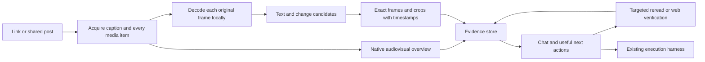

# Video understanding that can support action

The recommended starting point is Gemini for audiovisual reasoning, a local frame scanner for brief on-screen clues, and a small evidence store that the execution agent can query. Do not build a new foundation model or a large video-search service first. The product advantage should be finding the right evidence, turning it into a useful next step, and verifying that step worked.

This is a research and architecture recommendation, checked against primary sources on **12 September 2026**. No provider comparison benchmark was run and no paid API requests were made for this report. Proposed quality gates below are not achieved results.

## What changed since the existing implementation

The existing `src/services/geminiVideo.ts` uses `gemini-3.5-flash-lite`, the `generateContent` endpoint, a static 1 FPS/low-resolution overview, and a 2 FPS/high-resolution targeted reread. Its coverage wording correctly distinguishes overview completion from exhaustive inspection. However, this leaves brief clues between samples invisible to the model.

Google introduced **agentic video understanding on 1 September 2026**. Its announcement reports up to 88% fewer tokens and 66% lower costs in its own comparisons; these are vendor maxima, not ContextDrop forecasts. This is a material reason to benchmark the native capability before writing another custom navigation loop. [Google announcement](https://blog.google/innovation-and-ai/models-and-research/gemini-models/introducing-agentic-video-in-gemini/)

Gemini 3.8/3.7/3.6 Flash and 3.5 Flash-Lite support `processing: "agentic"` through Interactions. The model selects audiovisual evidence; `processing_call`/`processing_result` expose navigation steps. Static mode defaults to 1 FPS and supports custom clipping/FPS. Public YouTube URLs work directly. Neither mode guarantees every-frame comprehension. [Gemini video documentation](https://ai.google.dev/gemini-api/docs/video-understanding)

## Provider and component choice

| Option | Useful role | Decision and limitation |
|---|---|---|
| Gemini 3.5 Flash-Lite / 3.8 Flash | Audiovisual explanation, contextual questions, targeted rereading | Benchmark both. Start Lite for indexing; use Flash when uncertainty or the evaluation justifies it. Native agentic mode is a candidate for long-video questions, not proof of exhaustive coverage. |
| TwelveLabs Pegasus 1.5 | Specialist video analysis and segmentation | Keep as an evaluation challenger. General analysis accepts media without pre-indexing, supports reference images, and offers clipped requests. Minimum clip duration is four seconds. [Migration guide](https://docs.twelvelabs.io/docs/get-started/migration-guides/pegasus-1-2-to-1-5) |
| TwelveLabs Marengo | Search across a substantial video library | Defer until measured library retrieval failures justify another service. Current hosted search has indexing, recurring infrastructure, and query charges; Marengo 3.5 search is through Jockey. [Pricing](https://www.twelvelabs.io/pricing) |
| Qwen3-VL 4B/8B | Local or self-hosted vision/OCR challenger | Open weights and Apache-2.0 repository; controllable frame and pixel budgets. Its examples also sample video, with a 2 FPS processor default. Long context and OCR claims do not establish one-frame recall. Pair with ASR for audio. Do not assume a small local model matches frontier API accuracy. [Official repository](https://github.com/QwenLM/Qwen3-VL) |
| Apple Vision | Local text boxes and OCR on a Mac | Best first implementation candidate for a small Mac helper. It returns text alternatives, confidence, and location; fast/accurate settings trade speed against accuracy. Test actual laptop throughput. [Apple tutorial](https://developer.apple.com/tutorials/develop-in-swift/extract-text-from-images) |
| PaddleOCR | Portable text detector/recognizer | Useful alternative if Apple Vision misses the target fonts/languages or Windows is needed. The project supports local deployment and ONNX paths; distinguish its hosted API command from local inference. [Official repository](https://github.com/PaddlePaddle/PaddleOCR), [API CLI](https://github.com/PaddlePaddle/PaddleOCR/blob/main/docs/version3.x/inference_deployment/serving/paddleocr_official_api/cli.en.md) |
| whisper.cpp | Local searchable speech transcript | Optional cost/privacy path with Apple Silicon acceleration. Speech only; it cannot recover a silent GitHub screenshot. Transcription quality and word timing need independent checks. [Official repository](https://github.com/ggml-org/whisper.cpp) |

TwelveLabs removed Pegasus 1.2 on **18 August 2026**; old comparisons and integration examples using it are stale. [Release notes](https://docs.twelvelabs.io/docs/get-started/release-notes)

**High-fit reuse candidate:** [Qwen-MM-Plugins](https://github.com/QwenLM/Qwen-MM-Plugins) packages media reading, frame export, hosted multimodal tools, and long-video memory as skills/MCP tools, including Codex and Claude Code setup. Its `video-memory` design indexes events and on-screen text for subsequent questions. `core` can supply images to the existing harness; hosted understanding uses provider credentials. This is architectural inspiration for giving an existing agent good eyes and memory. It is not proof of Instagram import reliability, millisecond capture, or safe execution. Only documentation was inspected; audit the exact immutable component release before reuse. Its broad suite should not become a mandatory dependency bundle. [Capabilities](https://github.com/QwenLM/Qwen-MM-Plugins/blob/main/docs/en/capabilities.md)

## What “every millisecond” actually requires

A 30 FPS source contains about one image every 33.3 ms; 60 FPS contains one every 16.7 ms. No reader can recover visual information absent from the encoded source. A file decoded at its original frame rate can preserve every encoded frame; understanding every frame correctly is a separate problem.

For a uniformly timed 1 FPS sample and a randomly positioned clue visible for 100 ms, the approximate probability that even one sample intersects it is only 10%. At 2 FPS it is roughly 20%. These are sampling calculations under a random-phase assumption, not model benchmark results. A single 30 FPS frame has only about a 3.3% chance of intersecting a 1 FPS sample. Asking a smarter model does not recover an unseen frame.

The correct promise is: **“Find fleeting details, show the exact evidence, and check uncertain readings.”** Do not promise human-equivalent comprehension of all milliseconds. Cropping and rereading can improve readability; invented sharpening cannot reconstruct a prompt that was never legible or never displayed. If the creator never shows the full prompt, the app may offer an explicitly labeled reconstructed prompt, not claim to extract the original.

An offline experiment now demonstrates this sampling problem on one controlled fixture: a four-second, 30 FPS lossless video containing a 33 ms repository clue, a 67 ms prompt, and a 500 ms command. FFmpeg's actual 1 FPS and 2 FPS sampling each retained only the command. A simple change detector examined all 120 frames, selected seven candidates, and retained all three clues. This establishes candidate retention on a static synthetic background, not real-world OCR accuracy or provider quality. [Fixture results](transient-evidence-result.json), [experiment implementation](../../scripts/experiments/transient-evidence.mjs).

## Recommended acquisition and reading pipeline

1. **Acquire the actual post.** Normalize a source into caption, author, canonical identity, ordered media items, dimensions, duration, and acquisition status. A carousel is multiple first-class items, not a failed video. A caption can be ready while media retrieval is blocked. Never label that state “video understood.” Retain original-quality media locally when available, with an explicit retention policy.
2. **Produce a quick audiovisual orientation.** Understand the topic, demonstrated behavior, creator claims, mentioned tools, and likely useful questions. Avoid assuming every post is a build tutorial. For long content compare native agentic navigation against a static/chapter overview; choose from measured coverage and latency, not marketing claims.
3. **Inspect every decoded frame cheaply.** Preserve presentation timestamps rather than calculating `index / nominal FPS`, especially for variable-frame-rate media. FFprobe exposes frame/stream metadata and frame counts. [FFprobe documentation](https://ffmpeg.org/ffprobe.html) Run tiled visual-change and text-region detection over each decoded frame. Whole-frame perceptual hashes alone can miss a tiny new URL in an otherwise identical screen.
4. **Retain evidence candidates, not millions of JPEGs.** Keep the original file, timestamped candidate crops, sharp representative frames, and a manifest of analyzed ranges. New text regions, region changes, scene cuts, browser/address bars, terminal lines, and GitHub-shaped screens raise priority. Do not discard isolated one-frame candidates merely because they lack temporal persistence.
5. **Read likely useful details at source resolution.** Use accurate OCR and vision on the crop plus neighboring full frames. Store alternatives and exact source-frame references. Verify extracted repo/domain identities against current official pages. A real repository with a similar name is still only a candidate until the source matches it.
6. **Let chat ask for more evidence.** Search speech, OCR, entities, and timestamped observations. When confidence is low, reopen the exact local frames or a short dense clip, not the entire video. Distinguish “creator says,” “visible at this moment,” “independently checked,” and “my recommendation.”
7. **Pass evidence and the user's goal to execution.** The harness receives the requested outcome and relevant evidence, not source text masquerading as authority. Finishing a script does not prove the requested outcome. Require a task-specific visible result, file, test, or browser check before marking the action complete.

The candidate detector can still miss low-contrast or tiny text; decoding every frame does not imply OCR was accurate on every frame. Add an explicit exhaustive OCR mode for a short selected interval when the user asks “what flashed there?” This is slower but bounded. Measure candidate recall separately from recognition accuracy so the failure is diagnosable.

## Cost model

Standard paid list prices: Flash-Lite **$0.30/M input and $2.50/M output**. Gemini 3.8 Flash **$0.75/M input and $3.75/M output through 31 December 2026**, then $1.50/$7.50. [Google pricing](https://ai.google.dev/gemini-api/docs/pricing)

The estimates below use the low-resolution approximation in Google's mode-specific token guide: 100 input tokens/second. Each assumes 1,000 prompt tokens and 2,000 generated tokens including thinking. Formula: `(seconds × 100 + 1000) × input_rate / 1e6 + 2000 × output_rate / 1e6`. Acquisition, local compute, storage, retries, search, chat, and rereads are excluded. These are planning estimates; use provider usage for billing. [Token accounting](https://ai.google.dev/gemini-api/docs/tokens#video-token-usage-by-processing-mode)

| Source length | Flash-Lite | 3.8 Flash promotional rate |
|---|---:|---:|
| 1 minute | $0.0071 | $0.0128 |
| 10 minutes | $0.0233 | $0.0533 |
| 30 minutes | $0.0593 | $0.1433 |
| 60 minutes | $0.1133 | $0.2783 |

Agentic mode has content-dependent navigation/thinking charges, so do not apply a flat 88% discount. Track input, output, thought, and tool-use tokens separately. [Token accounting](https://ai.google.dev/gemini-api/docs/tokens#video-token-usage-by-processing-mode) For dense high-resolution video, the documented 258 tokens/frame plus 32 audio tokens/second would imply 466,320 input tokens for 60 seconds at 30 FPS, excluding metadata. This is arithmetic, not a tested API configuration. [Video tokenization](https://ai.google.dev/gemini-api/docs/video-understanding#technical-details-video) Most duplicate frames buy little useful information; local detection should choose the evidence worth model attention.

TwelveLabs Analyze lists **$1.75/video-hour plus $7.50/M output tokens**. A 30-minute request plus 2,000 output tokens is approximately **$0.89**, before other services. Hosted Search lists **$2.50/hour indexing, $0.09/hour/month infrastructure, and $4/1,000 queries**. These are separate services, not costs that must all be paid for one Analyze request. [TwelveLabs pricing](https://www.twelvelabs.io/pricing)

The first budget rule should be per-source/per-question metering with cancellation and reusable results. Repeated chat should retrieve compact evidence instead of rereading the whole source. No GPU subscription or dedicated vector database is needed until benchmarks show that either improves the actual experience.

## Inexpensive evaluation before choosing the stack

Create a reproducible, owned synthetic corpus plus a separately consented/public-use set. Keep expected answers hidden from inference prompts. Each run records source hash, model/version, exact sampling policy, provider usage, latency, evidence references, retries, and outcome. Use two human reviewers for ambiguous legibility. Keep evaluation source instructions untrusted.

| Set | Contents | What it prevents |
|---|---|---|
| 40 synthetic clips, 20 seconds each | Prompts/repo names/URLs visible for 1, 2, 3, 6, and 15 frames; 24/30/60 FPS; dark/light UI; tiny address bar; compression; slides; variable FPS; no target clues in controls | A summary benchmark concealing poor fleeting-detail recall |
| 24 real Instagram posts | Eight Reels, eight photos, eight carousels; ordered items and caption ground truth | Calling upload support “Instagram support” |
| 12 additional real short videos | YouTube/TikTok/X, talk-only recommendations, silent demos, code and design examples | Overfitting every source to coding tutorials |
| 8 longer videos | 20–60 minutes, needles at beginning/middle/end, cross-chapter questions | Good answers only from the beginning of a source |
| 10 outcome tasks | Find/open a repo, extract a visible prompt, compare tools, adapt a workflow, create and verify a small artifact | Treating chat quality as execution quality |

Proposed internal release gates:

- **Acquisition:** every item and its order correct on the declared supported Instagram test set; blocked/private/deleted sources return a clear recoverable status, never fabricated media. Recheck on separate days. This measures the chosen set, not every Instagram post.
- **Frame accounting:** 100% of decodable source frames accounted for in exhaustive mode; corrupt or skipped intervals explicitly reported.
- **Candidate recall:** at least 95% of human-readable inserted clues selected, reported separately for one-frame and longer clues. If the one-frame bucket fails, do not advertise that capability.
- **Recognition:** at least 95% exact normalized repo/URL matches for readable clues; prompt character error rate reported by size/contrast/duration. No silent character substitution in URLs or code.
- **Grounding:** at least 95% of checked factual answer claims supported by the linked evidence; zero fabricated extracted repo identities on negative controls. Explicit abstention when the source lacks the requested text.
- **Execution:** at least 9/10 scoped tasks produce independently checked outputs; every failure is visible and resumable. Separate prepared, running, completed, and verified states.
- **Experience:** measure time to first useful answer separately from full indexing and successful action. Initial targets: median useful answer under 45 seconds for accessible short posts, subsequent evidence-backed chat under 15 seconds; report P95 and network conditions. These targets have not been measured.

Compare five policies on the same corpus: current static 1 FPS; native agentic Lite; native agentic Flash; local detector plus native reasoning; and a small TwelveLabs challenger subset. Use Qwen/Apple/Paddle on the synthetic OCR subset before investing in full self-hosted VLMs. Allow a hard evaluation spending cap, such as $25, with an estimate before each batch. Ingestion reliability and exact evidence should be chosen before landing-page animation or additional agent frameworks.

## Primary sources

All URLs below were accessed **12 September 2026**. Unless a publication date is specified, they are live documentation or repository pages without a fixed publication date. Provider claims and recommended engineering decisions are distinguished in the report; none of these sources independently validates ContextDrop's outcome quality.

1. Google, [Introducing agentic video understanding with Gemini](https://blog.google/innovation-and-ai/models-and-research/gemini-models/introducing-agentic-video-in-gemini/), published 1 September 2026.
2. Google, [Video understanding](https://ai.google.dev/gemini-api/docs/video-understanding).
3. Google, [Understand and count tokens](https://ai.google.dev/gemini-api/docs/tokens), page updated 4 September 2026.
4. Google, [Gemini Developer API pricing](https://ai.google.dev/gemini-api/docs/pricing).
5. TwelveLabs, [Pricing](https://www.twelvelabs.io/pricing).
6. TwelveLabs, [Migrate from Pegasus 1.2 to Pegasus 1.5](https://docs.twelvelabs.io/docs/get-started/migration-guides/pegasus-1-2-to-1-5).
7. TwelveLabs, [Release notes](https://docs.twelvelabs.io/docs/get-started/release-notes), 18 August 2026 removal entry.
8. Qwen team, [Qwen3-VL repository](https://github.com/QwenLM/Qwen3-VL).
9. Apple, [Extract text from images](https://developer.apple.com/tutorials/develop-in-swift/extract-text-from-images).
10. PaddlePaddle, [PaddleOCR repository](https://github.com/PaddlePaddle/PaddleOCR).
11. PaddlePaddle, [PaddleOCR official API CLI](https://github.com/PaddlePaddle/PaddleOCR/blob/main/docs/version3.x/inference_deployment/serving/paddleocr_official_api/cli.en.md).
12. ggml contributors, [whisper.cpp repository](https://github.com/ggml-org/whisper.cpp).
13. Qwen team, [Qwen-MM-Plugins repository](https://github.com/QwenLM/Qwen-MM-Plugins).
14. Qwen team, [Qwen-MM-Plugins capabilities](https://github.com/QwenLM/Qwen-MM-Plugins/blob/main/docs/en/capabilities.md).
15. FFmpeg contributors, [ffprobe documentation](https://ffmpeg.org/ffprobe.html).
