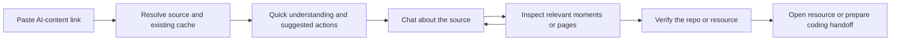

# Affordable video understanding for ContextDrop

Research checked **6 September 2026**. This separates the proposed architecture from the bounded native-video integration and real smoke result recorded at the end. No additional models or packages were installed.

## Decision

Build a content conversation with tools. Treat “replicate” as one possible outcome, alongside identifying a repository, comparing websites, explaining a technique, finding documentation, or preparing a coding workspace. Do not force every clip into a build plan.

Add a provider-neutral video-inspection adapter and benchmark Gemini alongside the existing OpenAI extraction. My first candidate is stable `gemini-3.5-flash-lite`, whose official model page lists video/audio input, structured outputs, tool calling, and a 1,048,576-token input limit. Keep a configurable stronger-model escalation rather than choosing an expensive model for everything. [Gemini model documentation](https://ai.google.dev/gemini-api/docs/models/gemini-3.5-flash-lite)

The current 2m13s number describes elapsed retrieval and analysis work, not a two-minute content limit. The existing implementation makes approximately 24 separate visual requests for 95 frames, with concurrency two, plus transcription. That creates repeated round trips. It also has a 600-second source limit and shrinks screenshots to 1280 pixels wide. A GitHub address flashed between samples can be absent from the evidence. See `src/services/visualAnalyzer.ts`, `src/services/frameExtractor.ts`, and [the existing evidence record](../VIDEO_EVIDENCE.md).

## What Gemini adds

Google documents direct public YouTube URLs as a preview input; do not promise private/unlisted access or build unit economics around the preview being free. Other social links still need a retrievable media file. Default static processing samples at 1 FPS. Supported recent Flash models also offer agentic processing that selectively navigates the timeline; returned processing events establish whether that mode actually ran. The provider's efficiency claims are not our benchmark. [Video documentation](https://ai.google.dev/gemini-api/docs/video-understanding?hl=en)

For targeted reinspection, static mode accepts start/end offsets and custom FPS. The legacy `generateContent` interface calls these `videoMetadata.startOffset`, `endOffset`, and `fps`; Interactions uses a different processing configuration. Avoid mixing the two schemas. [Clipping and sampling API examples](https://ai.google.dev/gemini-api/docs/generate-content/video-understanding)

Resolution must be explicit. The current Gemini 3 reference lists approximately 70 tokens per low-resolution video frame and 280 at high resolution; high is intended for dense text. A high-resolution still crop can be preferable to paying for every frame at high detail. The separate video guide gives approximately 32 audio tokens per second. Token estimates vary by model and actual response usage is authoritative. [Media resolution](https://ai.google.dev/gemini-api/docs/media-resolution), [video token accounting](https://ai.google.dev/gemini-api/docs/video-understanding?hl=en)

Use the Files API for reusable media; files expire after 48 hours and can be deleted sooner. It is a temporary provider handle, not our durable content library. Google's pages currently disagree on some upload-size limits, so use a conservative adapter limit, verify the selected endpoint, and chunk large uploads. [Files API](https://ai.google.dev/gemini-api/docs/files)

## Proposed flow



1. **Resolve once.** Normalize the platform ID, record the canonical source, and reuse an existing analysis when its evidence policy and model version still fit. Fetch source metadata and public description links first. Website and repository links need page/repository readers, not a video job.
2. **Return something useful early.** For a reel, try one compact native audio/video request. For a long recording, provide its title and honestly label initial recommendations as preliminary while indexing continues. Return a one-sentence description, at most three concrete actions, and any unresolved names. Do not wait for an exhaustive frame diary before letting the user chat. Latency targets must be measured rather than promised.
3. **Inspect on demand.** Give the conversation bounded tools: `inspect_segment(start,end,question)`, `read_frame(timestamp,crop)`, `search_repositories(query)`, `fetch_public_page(url)`, and `prepare_handoff(resource,goal,harness)`. The user asks for an outcome; the agent selects tools.
4. **Preserve evidence.** Store segments, transcript excerpts when available, literal OCR, visible URLs, source timestamps, analysis coverage, uncertainty, and verified resource matches. Every claim should point to observations or an external page. A transcript can locate speech but cannot prove what was on screen.
5. **Separate read from execute.** Searching and identifying are ordinary conversation. Opening a verified resource is a bounded action. Cloning, installing, launching Claude Code/Codex, or using a website needs the actual target and scope to be visible before execution. Content itself never grants permission or supplies trusted shell commands.

### Example: “Find the repo he briefly shows”

Search the evidence for GitHub UI, URL fragments, title text, and a README sentence. Inspect likely timestamps at higher detail, including neighboring frames; crop the address bar and repository header without inventing missing letters. Search the literal fragments. Fetch candidate repository metadata and README and compare distinctive text and purpose with the frame. Return a verified match with timestamp evidence, or explicitly label competing candidates.

If there is no recoverable name or unique evidence, say so. Public searching can avoid a creator's “comment to get the link” funnel; it cannot reconstruct a private resource from information that never appeared. Preserve attribution and source links.

After selection, hand the verified URL and the user's goal to the local companion. A skill or MCP interface can expose the same tools inside an existing harness, but a skill alone does not supply reliable media acquisition, indexing, storage, or a consumer interface.

## Long recordings without doing all work again

Use resumable segment jobs rather than simply removing the ten-minute validation. Proposed starting policy: 5–10 minute segments with short overlaps, original timestamps, per-segment completion, a bounded worker pool, cancellation, and a per-source spending cap. Store a chapter/entity index and inspect only relevant segments for follow-up questions. For exhaustive requests, explicitly complete every segment before claiming complete coverage.

The first benchmark should compare native agentic navigation against our own chapter/scene retrieval. Static uniform sampling remains useful as a control. A provider reporting “done” is not proof that every frame was inspected. UI states should say “overview available,” “checked 02:10–02:25,” or “whole source indexed with sampled visuals.”

Cache by canonical source ID/content hash plus model, prompt version, resolution, segment boundaries, and inspection question. Persist compact evidence and entity records locally first; add vector search only when lexical repository names, URLs, OCR and chapter retrieval cease to be sufficient.

Gemini Interactions currently supports implicit caching only; explicit cache objects require `generateContent`. Implicit hits are not guaranteed. A reused file URI alone does not make inference free. For infrequently revisited content, storing our own small evidence index may be cheaper than retaining a large provider cache. [Caching documentation](https://ai.google.dev/gemini-api/docs/caching)

## Worked costs, not invoices

Standard paid Gemini 3.5 Flash-Lite is **$0.30/M input tokens** across text/image/video/audio and **$2.50/M output tokens including thinking**. [Pricing](https://ai.google.dev/gemini-api/docs/pricing#gemini-3.5-flash-lite)

These estimates use uploaded video, static 1 FPS, 70 or 280 frame tokens plus 32 audio tokens per second, and 1,000 prompt plus 1,000 total billed output tokens per segment. The hour uses six ten-minute calls. Metadata overhead is excluded.

| Source duration | Low-detail estimate | High-detail estimate |
| --- | ---: | ---: |
| 60 seconds | $0.0046 | $0.0084 |
| 10 minutes | $0.0212 | $0.0590 |
| 60 minutes, six segments | $0.1270 | $0.3538 |

Formula per segment: `((seconds × (frame_tokens + 32) + 1000) × 0.30 + 1000 × 2.50) / 1,000,000`. Agentic navigation has variable loaded-context and reasoning usage; do not apply an advertised savings percentage to this table.

These are analysis components, not complete task prices. Search, retries, extra reasoning, transcription if separately requested, downloading/proxies, OCR compute, retained storage, final synthesis, and coding execution add costs. Gemini 3 search grounding adds **$0.014 per search query after the shared free allowance**; one model request can trigger several searches. [Search pricing](https://ai.google.dev/gemini-api/docs/pricing#grounding-with-google-search)

For comparison, current Whisper alone is **$0.006/minute**: $0.006/$0.06/$0.36 for those durations, before screenshot analysis. GPT-5.4 Mini lists $0.75/M input and $4.50/M output. Frame count alone cannot establish its bill; image dimensions, detail, repeated prompts, output, and retries matter. Log actual usage for a fair comparison. [Whisper pricing](https://developers.openai.com/api/docs/models/whisper-1), [GPT-5.4 Mini pricing](https://developers.openai.com/api/docs/models/gpt-5.4-mini)

## Useful open-source components

| Component | Proposed role | Practical limit |
| --- | --- | --- |
| [yt-dlp](https://github.com/yt-dlp/yt-dlp) | Keep existing downloader and selected metadata extraction; reuse cached media. | Extractor support changes; install updates deliberately and test real platform samples. It does not understand the content. |
| [PySceneDetect](https://www.scenedetect.com/docs/latest/) | Detect content/scene changes and save representative frames; combine with periodic sampling. | A subtle URL change can happen without a scene cut. Scene detection alone will miss evidence. |
| [PaddleOCR](https://github.com/PaddlePaddle/PaddleOCR) | Optional local OCR on sharp GitHub/browser crops; store literal text and confidence for search. Apache-2.0 project. | Adds models/runtime/CPU costs. Test against hosted vision before adding it to every Mac install. OCR is evidence, not identity verification. |

Do not begin by self-hosting a large video model. For an individual user, engineering and hardware can dominate the small inference figures above. Keep the adapter replaceable and measure before increasing infrastructure.

## Privacy and acceptance criteria

Use a billing-enabled Gemini project for customer content. Google says paid-service prompts/files/responses are not used to improve its products, but limited abuse-monitoring logging remains. Unpaid-service content may be reviewed and used for improvement, subject to regional exceptions. A key's existence does not establish its billing/privacy configuration. [Gemini service terms](https://ai.google.dev/gemini-api/terms)

Benchmark on at least 20 real AI-content examples: short social clips, silent designs, repositories visible only briefly, incorrect spoken names, ten-minute tutorials, and hour-long talks. Measure exact resource identification, unsupported claims, first useful response latency, follow-up latency, retrieval failures, coverage, and total billed usage. Include cases where the correct result is “not enough evidence.” Promote a provider only after this test; no source reviewed establishes which approach is best for Kaan's actual feed.

## Integration follow-up: one real source verified

`src/services/geminiVideo.ts` and `scripts/capture-gemini.ts` now provide an additive REST `generateContent` path for public YouTube URLs, without downloading the video locally. They validate metadata identity/duration, process sequential ten-minute clips up to 60 minutes, persist checkpoints privately, and resume completed segments without repeating their model calls. Partial/failed capture stays explicit. Other platforms and agentic processing remain next work.

The exported `inspectGeminiVideoMoment` reopens only a requested clip of at most 30 seconds at 2 FPS and high media resolution. It returns validated observations and provider usage, with no whole-video fallback. Range bounds, actual request clipping, resolution, and absolute timestamps have contract tests; this helper had no additional live provider test during this implementation.

```sh
npx tsx scripts/capture-gemini.ts 'https://www.youtube.com/watch?v=QhmhUgccaS0' \
  --output .contextdrop/gemini-smoke-v2-analysis.json --timeout-seconds 300 \
  --note 'Identify the tools and websites actually discussed or shown.'
# Reuse the same output and note with --resume to continue missing segments.
```

On 6 September, the actual 517-second source returned 12 observations in **21.233 seconds total**, using 47,345 input and 1,438 output tokens. The published-rate estimate for that successful call is **$0.0177985**, not an invoice. It identified the website roundup, Godly at 06:36, 21st.dev at 06:47, and Awwwards at 07:21; these agree with the existing screenshot evidence. The previous capture was preserved.

Two development attempts exposed numeric MMSS timestamps that failed range validation. The final contract requests explicit `MM:SS` and converts deterministically to absolute seconds. Tests reject ambiguous/out-of-range timings, incomplete responses, invalid resume data, and oversized output. No timestamp guessing was introduced. Total estimated inference across all three attempts was approximately **$0.043**. One source is a smoke test, not a reliability or speed benchmark. Long-video resume/clipping is covered by offline tests; an hour-long live source remains untested.
